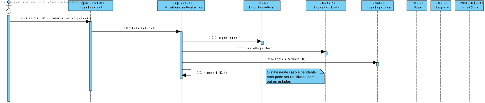
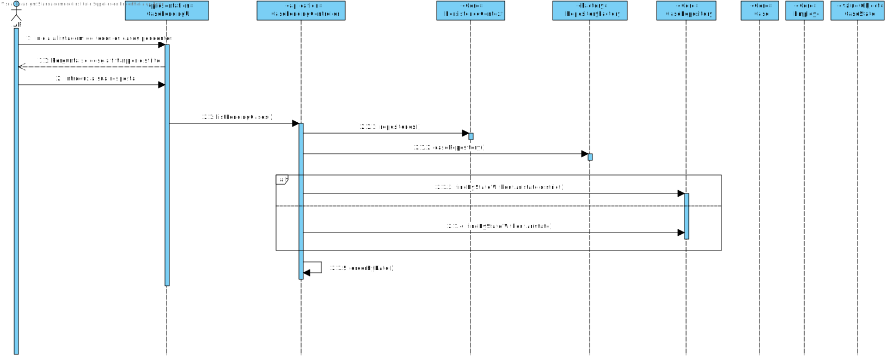
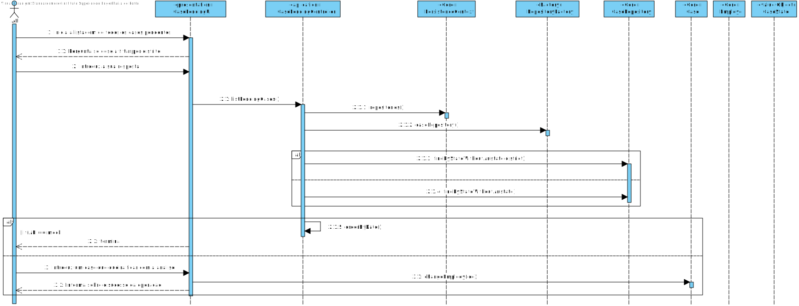

** [1161263](../)** - AR02
=======================================

# 1. Requisitos

+ AR06. Como AR pretendo consultar os Pedidos de Avaliação de Risco pendentes de validação e que ainda não estejam atribuídos a nenhum outro AR.

        AR02.1. Os pedidos devem ser apresentados sempre ordenados dos mais antigos para os mais recentes.

        AR02.2. Permitir (opcionalmente) que os pedidos sejam filtrados para um dado distrito (e.g. Porto).

        AR02.3. Permitir que o AR requeira para si a análise de um dos Pedidos de Avaliação de Risco pendentes. Como resultado, o Pedido de Avaliação de Risco fica atribuído ao respetivo AR e a data da atribuição deve ser registada.

   + Nota: As envolventes registadas pelos AR servem essencialmente para, por um lado, suprir limitações dos próprios serviços externos de georreferenciação na identificação/reconhecimento de certos tipos de envolventes; e, por outro lado, garantir que estas envolventes são tidas em consideração no calculo de índice de risco para locais (objetos seguros) na sua proximidade.

A interpretação feita deste requisito foi no sentido de, dado todos os pedidos de avaliação de risco, obter na totalidade todos os pedidos que estejam pendentes e ainda não estavam atribuidos a nenhum ar.

=====================================================================

# 2. Análise

*Neste secção o estudante deve relatar o estudo/análise/comparação que fez com o intuito de tomar as melhores opções de design para a funcionalidade bem como aplicar diagramas/artefactos de análise adequados.*

• Este caso de uso terá de ser implementado no módulo RISK ANALYSIS pois trata-se de uma user story do Analista de Risco. No entanto, vai interagir com o módulo CORE pois requer regras de negócio que estão neste implementadas e com o EXTERNAL_GEOREFERENCE_SERVICE para consultar os Pedidos de Avaliação de Risco pendentes de validação e que ainda não estejam atribuídos a nenhum outro AR.
• O objetivo deste caso de uso é tal como está definido no AR06 onde posteriormente serão implementados uma ordem nos pedidos, conforme um distrito e ainda atribuir o ar que deu log
• Para isto, o Analista de Risco,AR, terá que interagir com o sistema, enviando os parametros para o funcionamento do mesmo, e é solicitada uma confirmação dos dados introduzidos.
+ Nota: A atribuição não pode ser atribuida a um AR caso este tenha sido criado com o mock.

=====================================================================

# 3. Design

## 3.1. Realização da Funcionalidade

*Nesta secção deve apresentar e descrever o fluxo/sequência que permite realizar a funcionalidade.*

+ Inicialmente é apresentada na interface qual das opçoes deseja realizar.
+ + Caso deve so mostrar os casos, estes são apresentados.
+ + Caso queira apenas para um certo distrito o sistema pergunta para qual o distrito.
+ + No terceiro ponto tem em consideração o papel do utilizador, caso ele seja tenha permissão então pode pedir um caso associado a ele. Caso seja possivel é adicionado ao caso seu email.

## 3.2. Diagrama de Classes

## 3.3. Padrões Aplicados

+ PersistenceContext (base dados)

## 3.4. Testes 

+ Para testar se apenas sao obtidos os que estao em espera e sem nehum AR atribuido e ordenados.
 		@Test 
    	public void testListCasePending() {
        System.out.println("listCasePending");
        CaseController instance = new CaseController();
        List<String> expResult = new ArrayList<>();
        expResult.add(instance3.obtainCode());
        expResult.add(instance1.obtainCode());
        Iterable<CaseI> result = instance.listCaseByState(CaseState.WAITING);
        Iterator<CaseI> r = result.iterator();
        assertEquals(expResult.get(0), r.next().obtainCode());
        assertEquals(expResult.get(1), r.next().obtainCode());
    	}

+ Para testar se para um respetivo caso o utilizador que realizou o log in tenha permições, se ao adicionar o utilizador ao caso, este fica com a lista de empregados correta.
  	  @Test
    	public void testListCaseChange() {
        System.out.println("listCasePending");
        CaseController instance = new CaseController();
        List<InsuranceObject> li = new ArrayList<>();
        List<Email> ee = new ArrayList<>();
        LoginController.logged = PersistenceContext.repositories().UserRepository().obtainUserByEmail(new Email("admin1@gmail.com"));
        List<Email> e1 = new ArrayList<>();
        assertArrayEquals(instance2.getAssociatedEmployes().toArray(), e1.toArray());
        CaseController.changeCaseAr(new CaseCode("code2"));
        CaseI caseI = PersistenceContext.repositories().caseRepository().findByCaseCode(new CaseCode("code2"));
        e1.add(new Email("admin1@gmail.com"));
        assertArrayEquals(e1.toArray(), caseI.getAssociatedEmployes().toArray());
    	}

=====================================================================

# 4. Implementação

*Nesta secção o estudante deve providenciar, se necessário, algumas evidências de que a implementação está em conformidade com o design efetuado. Para além disso, deve mencionar/descrever a existência de outros ficheiros (e.g. de configuração) relevantes e destacar commits relevantes;*

+ Conforme o diagrama .3 é respeitado que apenas pode ficar encaregue de um caso caso seja administrador ou AR.

=====================================================================

# 5. Integration/Demonstration

*Nesta secção o estudante deve descrever os esforços realizados no sentido de integrar a funcionalidade desenvolvida com as restantes funcionalidades do sistema.*

+ A estrutura da funcionalidade utiliza a framework disponivel.
+ O listCaseByState podia ser so listar para os casos pendentes, mas foi levemente alterado para poder obter os casos para qualquer estado.
+ A estrutura cumpre os mesmos padroes utiizados anteriormente para maior compreensão.

=====================================================================

# 6. Observações

*Nesta secção sugere-se que o estudante apresente uma perspetiva critica sobre o trabalho desenvolvido apontando, por exemplo, outras alternativas e ou trabalhos futuros relacionados.*

+ Uma base de dados mais enriquecida para maior visualização e mais testes.

