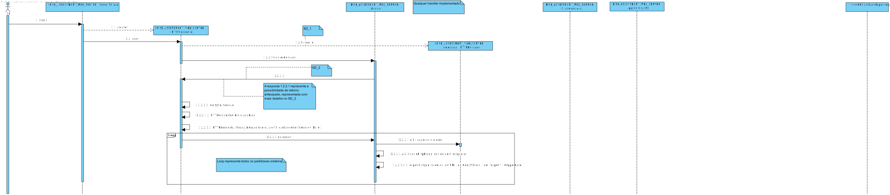
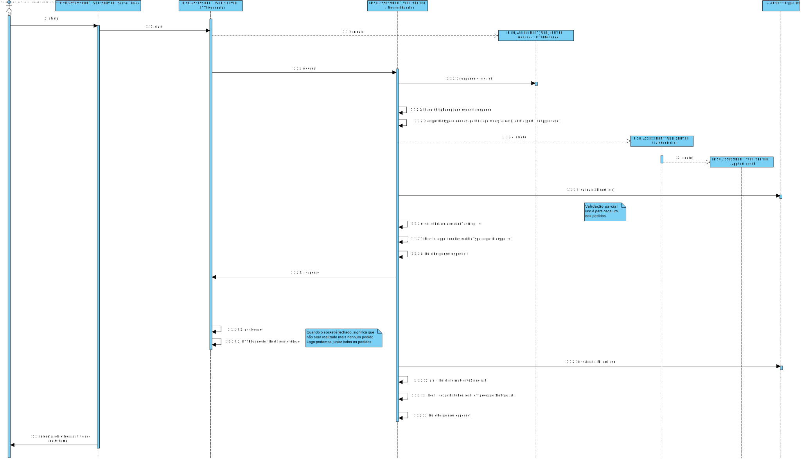

** [1161263](../)** - SE07
=======================================

# 1. Requisitos

+ SE07. Como SE pretendo obter um relatório estatístico da atividade realizada pelo Serviço de Avaliação de Risco desde a última vez que foi colocado em execução.

A interpretação feita deste requisito foi no sentido de, dado qualquer pedido do serviço deva apresentar o relatorio de todas as instruções realizadas, por exemplo intervalos, comparações entre outros.

Um sistema externo, submete um pedido de avaliação através de um pedido de HTTP (ou, futuramente HTTPS).

O pedido irá conter:
* um identificador do sistema (token, previamente gerado)
* o tipo de ficheiro que quer receber (XML/JSON/XHTML)

O webserver, posteriormente, irá interpretar e validar os dados recebidos e, caso válidos, reencaminhar o pedido para os módulos competentes. Após obter o resultado, este é retornado para o Sistema externo, através da conexão previamente estabelecida, em formato XML, JSON ou XHTML.

=====================================================================

# 2. Análise

*Neste secção o estudante deve relatar o estudo/análise/comparação que fez com o intuito de tomar as melhores opções de design para a funcionalidade bem como aplicar diagramas/artefactos de análise adequados.*

+ Este caso de uso será implementado no módulo RISK ASSESSEMENT WEBSERVER uma vez que o ator deste US é o sisterma externo. No entanto o módulo irá recorrer ao módulo RISK APP, que fará a análise necessária.
+ Apenas serao realizadas analises estatistica de us ja implementados.
+ Será necesario obter operar sobre pedidos de avaliação já concluidos.

=====================================================================

# 3. Design

+ Para este caso de uso necessitamos de criterios de filtragem: qual o serviço pedido.
+ Precisamos de verificar se os pedidos estão ou nao concluidos
+ O processo do sistema é de obter todos os pedidos e so quando o socket foi fechado(não havera mais pedidos) é que é junta toda a informação.

## 3.1. Realização da Funcionalidade

*Nesta secção deve apresentar e descrever o fluxo/sequência que permite realizar a funcionalidade.*

## 3.3. Padrões Aplicados

## 3.4. Testes 
 
 

=====================================================================

# 4. Implementação

*Nesta secção o estudante deve providenciar, se necessário, algumas evidências de que a implementação está em conformidade com o design efetuado. Para além disso, deve mencionar/descrever a existência de outros ficheiros (e.g. de configuração) relevantes e destacar commits relevantes;*

=====================================================================

# 5. Integration/Demonstration

*Nesta secção o estudante deve descrever os esforços realizados no sentido de integrar a funcionalidade desenvolvida com as restantes funcionalidades do sistema.*

=====================================================================

# 6. Observações

*Nesta secção sugere-se que o estudante apresente uma perspetiva critica sobre o trabalho desenvolvido apontando, por exemplo, outras alternativas e ou trabalhos futuros relacionados.*

