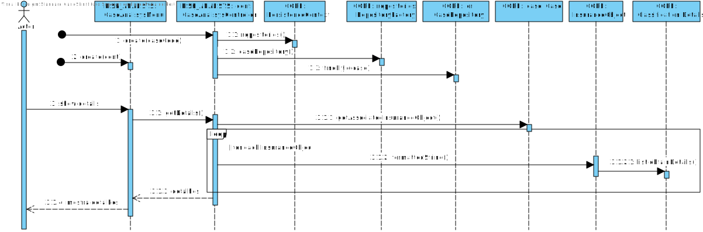
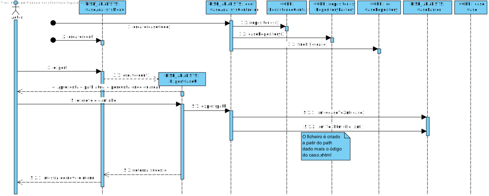
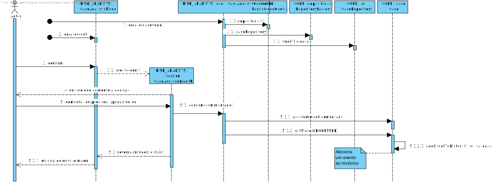
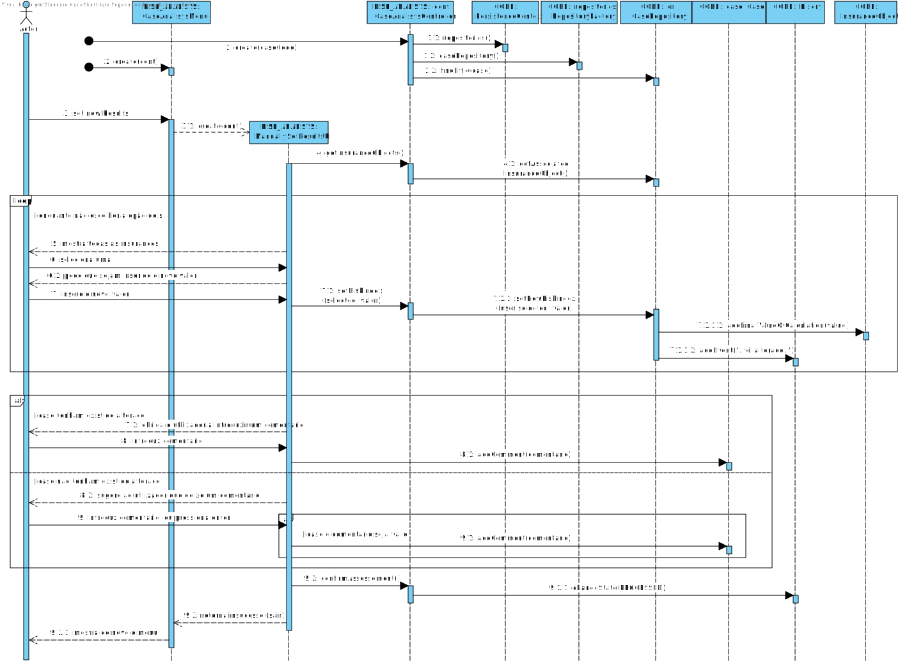
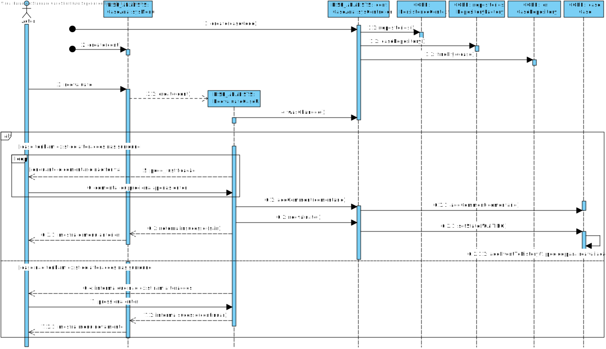

#**Aluno [1170527](../)** - AR04
##1. Requisitos
**AR04**. Como AR pretendo analisar um Pedido de Avaliação de Risco pendente de validação que esteja a mim atribuído.

* **AR04.1.** Os detalhes do Pedido de Avaliação de Risco devem ser apresentados.
* **AR04.2.** Permitir exportar a informação do Pedido de Avaliação de Risco em causa para um documento XHTML permitindo aquando da visualização do documento colapsar (esconder/mostrar) partes da informação (e.g. as justificações).
* **AR04.4.** Permitir que o AR confirme o(s) resultado(s) do Pedido de Avaliação de Risco, podendo este acrescentar algum comentário/observação (opcional). O pedido deve ser dado como concluído.

* **AR04.5.** Permitir que o AR atribua diretamente resultado(s) ao Pedido de Avaliação de Risco. Neste caso, é obrigatório introduzir uma fundamentação. O pedido deve ser dado como concluído.
* **AR04.6.** Permitir que o AR solicite uma reavaliação automática do Pedido de Avaliação de Risco. Neste caso, é necessário que o AR altere ou remova alguma da informação que suporta o(s) resultado(s) atual e/ou introduza novos dados (e.g. a existência de um quartel de bombeiros) que devem ser tidos em consideração. Após reavaliação automática ter ocorrido, o Pedido de Avaliação de Risco deve voltar a ser analisado pelo mesmo AR.

Quando um pedido é submetido (**SE01**), contêm informação sobre a necessidade de análise humana posterior, caso tal seja verificado é possível atribuir essa análise a um AR (**AR02**). 
Finalmente, no caso **AR03** é inicializada a análise, e é neste contexto que surge este caso de uso. 
O AR analisa os dados apresentados, podendo-os exportar para um ficheiro XHTML, acrescentar comentários, alterar os resultados obtidos ou adicionar, remover ou modificar informação relevante à avaliação (ex. Envolventes) e pedir uma reavaliação.

##2. Análise
+ Este caso de uso será implementado no módulo Risk Analisys uma vez que o ator deste US é o AR. Não obstante, são realizados pedidos para outros módulos, nomeadamente o CORE (RABL).
+ Idealmente, seria implementado o padrão State no caso, no entanto esta deficiência no projeto é originária do projeto de EAPLI e apenas foi detetada a meio do percurso de LAPR, pelo que, possivelmente, não existirá tempo para o implementar.
+ Uma vez que todas as validações e listagens de pedidos são feitas no caso de uso anterior (AR3),este US apenas incidirá sobre a apresentação, exportação e modificação dos dados.
+ Para exportar os dados para XHTML, o pedido será primeiro transformado em XML e depois, através de um XSTL será transformado em XHTML. Embora os passos intermédios sejam desnecessários, serão realizados de forma a serem aplicados os conceitos de LPROG lecionados.
+ Embora a ideia inicial fosse importar o xhtml com as alterações, tal revelou-se demasiado complexo para o tempo restante. Assim o ponto AR4.6 estará dividido em 4 funcionalidades:
	* Mostrar os surroundings relevantes para a avaliação.
	* Adicionar surroundings relevantes para a avaliação.
	* Remover surroundings relevantes para a avaliação.
	* Pedir reavaliação do caso.
+ De modo a registar todas as alterações feitas, foi adicionada uma classe Logger que é chamada ao longo das iterações com o caso.

##3. Design

###3.1. Realização da Funcionalidade
####**AR04.1** Listar detalhes

####**AR04.2** Exportar para ficheiro xhtml

####**AR04.4** Confirmar dados

####**AR04.5** Redifinir os valores obtidos

####**AR04.6** Pedir para o pedido ser reavaliado

###3.3. Padrões e Princípios Aplicados
Como este US era maioritáriamente chamar métodos já existentes, muitos dos padrões implementados, foram feitos noutras ocasiões, ex **Factory** e **Repository**, da framwork disponibilizada, ou o padrão **Adapter** dos Serviços de Georeferenciação externos.

No decorrer deste caso de uso, porém, foi necessário associar a cada fator de risco, qual o método de georeferenciação a ser utilizado. Assim, foi implementado o padrão **Strategy** cujas implementações saberiam qual o método a chamar.

Além disso, foram sempre tidos os padrões **GRASP** e os principios **SOLID**, delegando sempre pas responsabilidades para classes que se especializassem nessas, por exemplo.

###3.4. Testes
* Listar os detalhes quando existem detalhes
* Listar detalhes quando não existem detalhes
* Adicionar um comentário a um caso
* Confirmar a avaliação de um caso
* Adicionar surroundings relevantes a um insuranceObject
* Remover surroundings relevantes de um insuranceObject
* Listar as surroundings relevantes de um insuranceObject
* Iniciar pedido de reavaliação quando não foram alterados os suroundings relevantes de nenhum objeto seguro
* Iniciar pedido de reavaliação quando foram alterados os suroundings relevantes de um ou mais objetos seguros
* Alterar os resultados obtidos

##4. Implementação
###4.1 Ficheiros relevantes

* Ficheiro de transformação XSL

~~~~
<?xml version="1.0" encoding="UTF-8"?>

<xsl:stylesheet version="1.0"
                xmlns:xsl="http://www.w3.org/1999/XSL/Transform">
    <xsl:output method="xml"/>

    <xsl:template match="/">
        <xsl:text disable-output-escaping='yes'>&lt;!DOCTYPE html PUBLIC "-//W3C//DTD XHTML 1.0 Transitional//EN"
            "http://www.w3.org/TR/xhtml1/DTD/xhtml1-transitional.dtd"&gt;</xsl:text>
        <html>
            <body>
                <h1 id="code">
                    Caso
                    <xsl:value-of select="case/code"/>
                </h1>
                <xsl:for-each select="case/insurances/insuranceobject">
                    

                        <h2>
                            <xsl:value-of select="objectname"/>
                        </h2>
                        <h4>
                            <xsl:value-of select="location"/>
                        </h4>
                        <h4>Details</h4>
                        <ul>
                    
                            <xsl:for-each select="details/detail">
                                <li id="detail">
                                    <xsl:value-of select="."/>
                                </li>
                            </xsl:for-each>
                        </ul> 
                        <h4 id="riskIndex">
                            <xsl:value-of select="riskindex"/>
                        </h4>
                    
                         
                    
                        <h4>Classification</h4>
                        <table id="tabelaClass" border="1">
                         
                            <xsl:for-each select="classificationtable/coverageclass">
                            
                                <tr>
                                    <td rowspan="2">
                                        
                                    </td>
                                    <xsl:for-each select="surroundings/surroundingtype">
                                        <th id="surrounding" colspan="{count(riskfactors/riskfactor)}" scope="colgroup">
                                            <xsl:value-of select="sname"/>
                                        </th>
                                    </xsl:for-each>
                                </tr>
                            
                                <tr>
                                    <xsl:for-each select="surroundings/surroundingtype/riskfactors/riskfactor">
                                        <th id="metrica" scope="col">
                                            <xsl:value-of select="metric"/>
                                        </th>
                                    </xsl:for-each>
                                </tr>
                                <tr>
                                    <th id="coverage" scope="row">
                                        <xsl:value-of select="coveragename"/>
                                    </th>
                                    <xsl:for-each select="surroundings/surroundingtype/riskfactors/riskfactor">
                                        <td>
                                            <a href="#{../../../../coveragename} {metric} {../../sname}">
                                                <xsl:value-of select="classification"/>
                                            </a>
                                        </td>
                                    </xsl:for-each>
                                </tr>
                            </xsl:for-each>
                        </table>
                        
                        <xsl:for-each select="classificationtable/coverageclass/surroundings/surroundingtype/riskfactors/riskfactor">
                            

                                <h5>Relevant Surroundings&#160;<xsl:value-of select="../../../../coveragename"/>-<xsl:value-of select="metric"/>&#160;
                                    <xsl:value-of select="../../sname"/>
                                </h5>
                                <ul>
                                    <xsl:for-each select="relevantsurroundings/slocation">
                                        <li id="locations">
                                            <xsl:value-of select="."/>
                                        </li>
                                    </xsl:for-each>
                                </ul> 
                            

                        </xsl:for-each>
                    
                        

                    

                </xsl:for-each>
                

                    <h3>
                        Comments / Justification
                    </h3>
                    

                        <xsl:value-of select="case/comment"/>
                    

                

                

                    <h3>
                        History
                    </h3>
                    <ul>
                        <xsl:for-each select="case/history/entry">
                            <li id="entry">
                                <xsl:value-of select="."/>
                            </li>
                        </xsl:for-each>
                    </ul> 
                        
                

            </body>
        </html>
    </xsl:template>

</xsl:stylesheet>

~~~~

###4.2 Código Relevante
* Implementação de Stratagy

~~~~
public interface MetricStrategy extends ValueObject {
    public String getMetrics();
    
    public Designation getClassification(String source,List<String> locations,RiskFactor risk);    
}

public enum Metric implements MetricStrategy {
    DISTANCIA {
        @Override
        public String getMetrics() {
            return "Distancia";
        }

        @Override
        public String toString() {
            return getMetrics();
        }

        @Override
        public Designation getClassification(String source, List<String> locations, RiskFactor risk) {
            try {
                GeoReferenceUtil geo = new GeoReferenceUtil();

                if (locations.isEmpty()) {
                    locations.addAll(geo.getSurroundingsAsString(source, risk.obtainSTName()));
                }

                List<GeoRefServiceDTO> dtoList = new ArrayList<>();
                for (String local : locations) {
                    GeoRefServiceDTO dto = new GeoRefServiceDTO();
                    dto.name = local;
                    dto.merge(geo.getDistanceAndDuration(source, local, TravelMethod.DRIVING));
                    if (dto.distance > 0) {
                        dtoList.add(dto);
                    }
                }
                (...)
                return metodoDeGramática(distancia,risk.getSurroundingType());
        },
        TEMPO(...)
    }
  }
}
~~~~
* Garantir que só é possível a reavaliação caso tenham sido alterados dados
~~~~ 
@Override
    protected boolean doShow() {
        if (!c.wasChanged()) {
            Console.readLine("There were no modification that require reavaluation, press \"ENTER\" to return");
            return true;
        }
        String comment;
        while ((comment = Console.readLine("Please add a justification for these modifications")).trim().isEmpty());
        c.addComment("Justifiation of reavaluation: "+comment);
        c.reevaluate();
        return false;
    }
~~~~

##5. Integration/Demonstration

Nesta secção o estudante deve descrever os esforços realizados no sentido de integrar a funcionalidade desenvolvida com as restantes funcionalidades do sistema.
Como já referido, o maior desafio deste US foi associar um fator de risco a um método de georeferenciação, que foi resolvido com a implementação Strategy acima demonstrada.

##6. Observações

Nesta secção sugere-se que o estudante apresente uma perspetiva critica sobre o trabalho desenvolvido apontando, por exemplo, outras alternativas e ou trabalhos futuros relacionados.

Para a associação dos fatores de risco e os métodos de georeferenciação, poderiam, também, ter sido utilizado um ficheiro de configuração. 
Além disso, para os casos 4.5 e 4.6, o ideal seria que essa alteração fosse feita num ficheiro, que depois seria importado novamente.