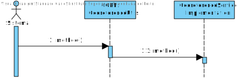
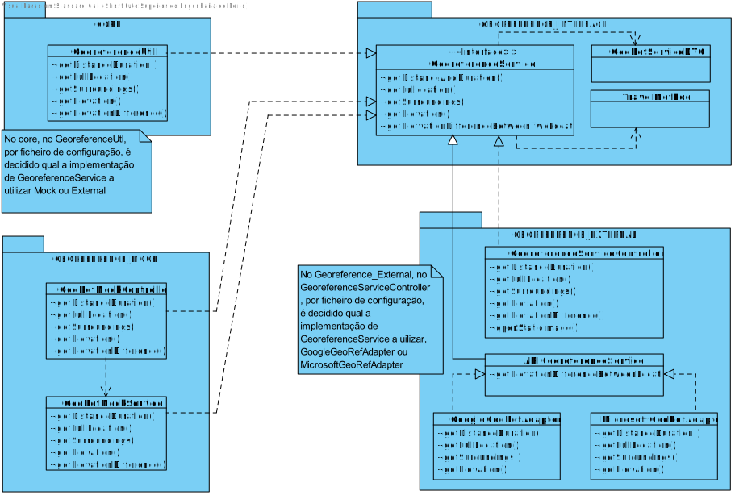

**Carlos Coelho [1170527](../)** - GP04.
=======================================

# 1. Requisitos

*Nesta secção o estudante deve indicar a funcionalidade desenvolvida bem como descrever a sua interpretação sobre a mesma e sua correlação e/ou dependência de/com outros requisitos.*

**GP04.** Como GP pretendo especificar por configuração qual o serviço de georreferenciação (MockGS_vs. _ExternalGS) que o sistema deve usar.

A interpretação feita deste requisito foi no sentido de implementar funcionalidade que controle qual o serviço de georreferenciação a ser usado no Sistema

# 2. Análise

*Neste secção o estudante deve relatar o estudo/análise/comparação que fez com o intuito de tomar as melhores opções de design para a funcionalidade bem como aplicar diagramas/artefactos de análise adequados.*

*Recomenda-se que organize este conteúdo por subsecções.*

## 2.1. Análise do Requesito

* Especificar por configuração qual o serviço de georreferenciação (MockGS_ vs. _ExternalGS) que o sistema deve usar, é alterar no ficheiro de configuração do Core qual o serviço usar e obter qual o escolhido nesse ficheiro.

## 2.2. Regras de Negócio

* MockGS_ ou. _ExternalGS 

## 2.3. Atores

* Sistema

# 3. Design

## 3.2. Diagrama de Classes

* **Core:**
~~~~
georeference.service=georeference.service.api
#georeference.service=georeference.service.mock
georeference.service.api=georeference.GeoreferenceServiceController
georeference.service.mock=georeferenceMock.GeoRefMockController
~~~~

## 3.3. Padrões/Principios Aplicados

*Nesta secção deve apresentar e explicar quais e como foram os padrões de design aplicados e as melhores práticas*

* GRASP
* SOLID
* Adapter

# 4. Implementação

*Nesta secção o estudante deve providenciar, se necessário, algumas evidências de que a implementação está em conformidade com o design efetuado. Para além disso, deve mencionar/descrever a existência de outros ficheiros (e.g. de configuração) relevantes e destacar commits relevantes;*

*Recomenda-se que organize este conteúdo por subsecções.*

## 4.1. Instanciação da Implementação de georeferenciação a utilizar
~~~~
     public String getGeoreferenceService(){
        return this.applicationProperties.getProperty(this.applicationProperties.getProperty(GEOREFERENCE_KEY));
    }~~~~

# 5. Integration/Demonstration

*Nesta secção o estudante deve descrever os esforços realizados no sentido de integrar a funcionalidade desenvolvida com as restantes funcionalidades do sistema.*

* Esta funcionalidade integra-se com todas as funcionalidades que utilização a localização visto que a utilização do Mock ou não faz com que os valores obtidos sejam diferentes em teoria.

# 6. Observações

*Nesta secção sugere-se que o estudante apresente uma perspetiva critica sobre o trabalho desenvolvido apontando, por exemplo, outras alternativas e ou trabalhos futuros relacionados.*

* Esta funcionalidade possibilita a opção de escolha de como a localização é obtida.

