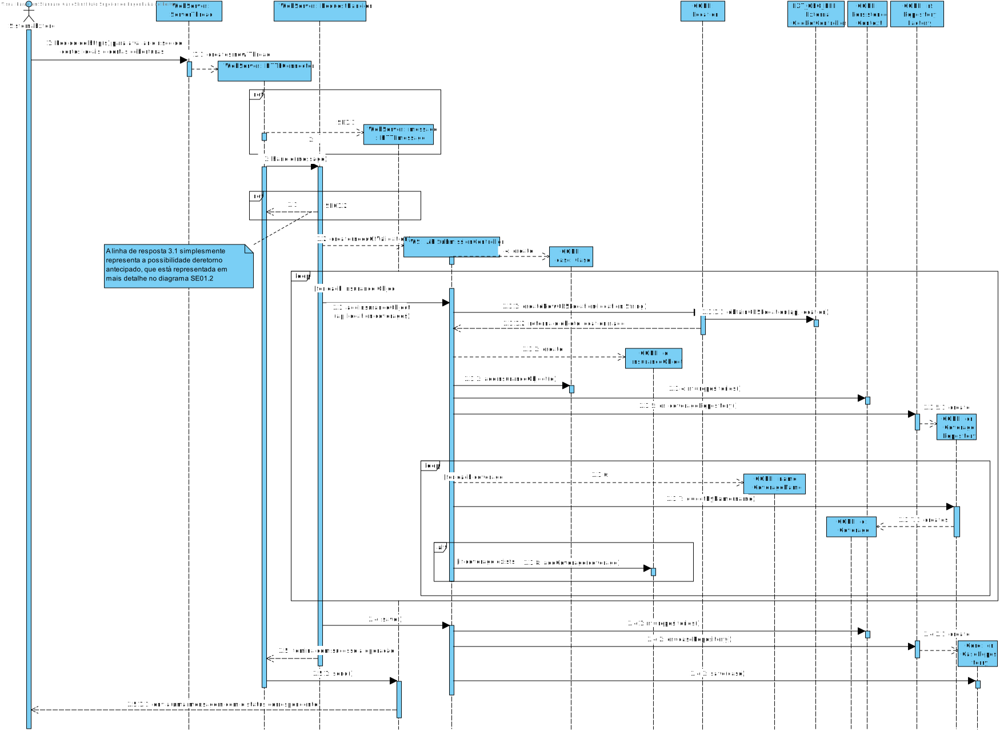
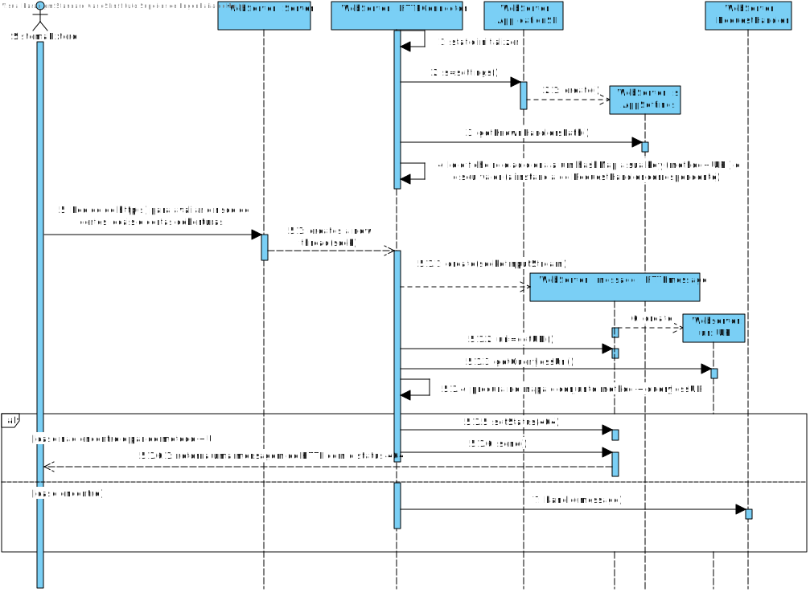
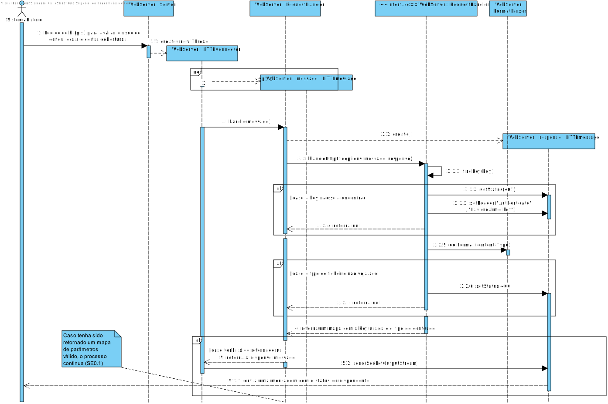
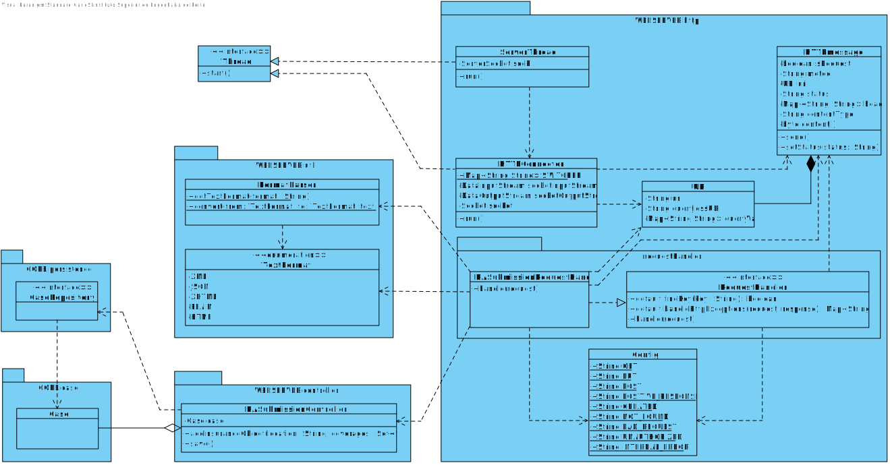

#Aluno 1170527 - SE01
##1. Requisitos
**SE01** - Como SE pretendo submeter um Pedido de Avaliação de Risco para um ou mais locais, sendo indicado para cada local o conjunto de coberturas pretendido.

.

Um sistema externo, submete um pedido de avaliação através de um pedido de HTTP ou HTTPS. 

O pedido irá conter:
* um identificador do sistema (token, previamente gerado)
* ~~o tipo de ficheiro que quer receber (XML/JSON/XHTML)~~ A mensagem retornada neste US não tem body, apenas status
* informação sobre quais os locais (e coberturas correspondentes) a serem avaliados no pedido, em formato XML ou JSON

O webserver, posteriormente, irá interpretar e validar os dados recebidos e, caso válidos, processa o pedido. Por fim, retorna uma mensagem de status correspondente ao resultado da operação (por exemplo created, em caso de sucesso).

##2. Análise
+ Este caso de uso será implementado no módulo RISK ASSESSEMENT WEBSERVER uma vez que o ator deste US é o sisterma externo. No entanto o módulo irá recorrer ao módulo CORE, para que este faça a persistência necessária.
+ O pedido só será aceite, caso o token recebido seja reconhecido pelo sistema. Inicialmente existia uma restrição de exclusividade de acesso ao webserver, por cada token, isto é, uma determinada token, só podia enviar outro pedido, uma vez que tivesse recebido a resposta do anterior. O que mais tarde concluimos que não faria sentido porque o mesmo SE poderia fazer vários pedidos num curto espaço de tempo e tal não deveria tornar o token/key inutilizável.
+ Uma vez que o pedido de análise ficará registado no sistema, o método HTTP usado será PUT
+ Serão utilizados os seguintes headers:
	* Authorization: [key]
	* Content-Type: [xml/json]

+ Serão utilizados as seguintes querries:
	+ needOfAnalisys="yes" (opcional   

+ Caso não seja enviada nenhuma query a especificar a nessecidade de análise posterior, é considerado que não é necessário
+ O conteúdo da mensagem, será apenas o pedido a ser registado, em formato XML ou Json
+ Em discussão com elementos de outro grupo, foi apresentada a ideia de ter uma classe com um (SwitchMap) mapa que para cada par (Method,URI) tinha uma classe correspondente que implementaria uma interface com um método de interpretação do pedido recebido. Apesar de na altura parecer uma ideia que acrescentaria classes desnecessárias ao projeto, a modularidade do projeto e legibilidade do código benificiam bastante desta implementação, pelo que a usaremos.

##3. Design

###3.1. Realização da Funcionalidade
####SD SE01

####SD SE01.1

####SD SE01.2

### 3.2. Diagrama de Classes

###3.3. Padrões e Princípios Aplicados
Seguem-se apenas alguns exemplos de aplicações de padrões/princípio relevantes
* **GRASP**
	De modo a reduzir o acoplamento (**Low Coupling**), e aumentar a coesão(**High Cohesion**), foram criadas as classes RASubmissionRequestHandler e RESubmissionController, aplicando, assim, os padrões **Pure Fabrication** e **Indirection**. Deste modo, há uma divisão clara: 
    * O Handler é o responsável por interpretar a mensagem, validando-a e reencaminhando o conteúdo extraído para o Controller.
    *  O Controller apenas conhece o domínio (CORE) e tem toda a informação necessária à criação das suas instâncias (**Creator** e **Information Expert**).

* **SOLID**
	Dos princípios SOLID existentes ao longo do projeto, vale a pena destacar a utilização de um "SwitchMap" (referido na análise) que é criado a partir de um ficheiro de configuração. A ideia consiste em utilizar um mapa, que faz a correspondência entre um pedido HTTP e a classe que o interpretará. Uma vez que o mapa depende de uma interface, RequestHandler (**D. Inversion Principle**) não são necessárias alterações ao código de cada vez que um novo Handler é adicionado (**Open-closed Principle**). Além disso, ao fazer a distinção de pedidos desta forma, é garantido que cada Handler apenas muda por motivos diretamente relacionados a si (ou às suas dependências) (**Single Responsability Principle**), ao invés de ter esta discriminação HardCoded, que levaria a alterações constantes ao longo da evolução do projeto.
    

###3.4. Testes

-

##4. Implementação
* Ficheiro de configuração do mapa de handlers
~~~~
<handlers>
    <handler>
        <method>PUT</method>
        <uri>/riskAssessment/cases/submit</uri>
        <className>http.requestHandler.RASubmissionRequestHandler</className>
    </handler>
    ...
</handlers>~~~~

Nesta secção o estudante deve providenciar, se necessário, algumas evidências de que a implementação está em conformidade com o design efetuado. Para além disso, deve mencionar/descrever a existência de outros ficheiros (e.g. de configuração) relevantes e destacar commits relevantes;

Recomenda-se que organize este conteúdo por subsecções.
##5. Integration/Demonstration

Nesta secção o estudante deve descrever os esforços realizados no sentido de integrar a funcionalidade desenvolvida com as restantes funcionalidades do sistema.

Uma vez que esta era a primeira US relativa ao Webserver, foi necessário adotar uma estratégia que fosse simples de usar e tivesse uma boa escalabilidade, do modo a facilitar futuras implementações. Deste modo, não só foi definido o interpretador de mensagens e o distribuidor de pedidos, como foram fornecidas classes que permitem o parseamento de XML para Json (e vice-versa) de uma forma simples e eficaz.

Seguindo a figura 2 do enunciado (Vista Lógica pretendida), foi prestada atenção ao facto deste módulo apenas conter dependências para o CORE. 

##6. Observações

Nesta secção sugere-se que o estudante apresente uma perspetiva critica sobre o trabalho desenvolvido apontando, por exemplo, outras alternativas e ou trabalhos futuros relacionados.

Embora esteja relativamente satisfeito com o resultado final, existem alguns pontos a melhorar. 

Primeiramente, foi usada a classe HTTPmessage, fornecida em RCOMP, para a interpretação de mensagens HTTP. Como referido nas PLS respetivas, esta classe não está totalmente completa, uma vez que, por exemplo, descartava os headers que não fossem content-type e content-lenght. 
No entanto, tal não foi relevante pois simplesmente foram alterados os campos que não estavam de acordo com o pretendido (nomeadamente dividir o URI entre path e query). 
Apesar da classe cumprir, atualmente, todos os requesitos, não está a aplicar totalmente as boas práticas lecionadas em EAPLI, visto que cada campo da HTTPmessage deveria ser, por si, uma classe com as suas próprias regras. 

Outro ponto que poderia ser melhorado, é a distribuição de tarefas nos Handlers. Por um lado é da responsabilidade do Handler interpretar e processar a mensagem recebida de forma a que o controller possa ser executado corretamente, sem ter de procesar qualquer tipo de lógica. Por outro, uma vez que são vários os parâmetros a serem analisados na mensagem, a sua interpretação é bastante complexa.

Por fim, no sistema de validação de tokens, estes poderiam estar numa base de dados em vez de num ficheiro, uma vez que seria mais rápida a sua verificação.