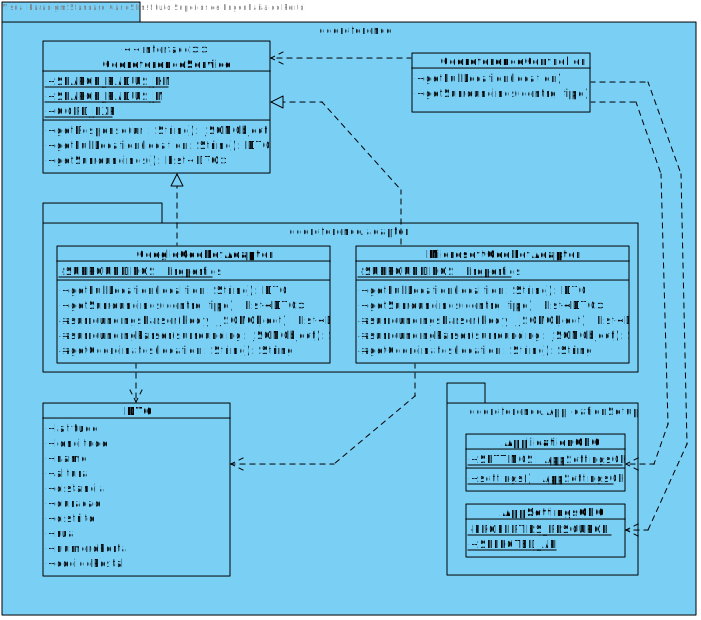

#**Aluno [1170527](../)** - SG03
##1. Requisitos
**SG03:** Como SG pretendo obter quais são as envolventes (designação e localização) de um determinado tipo (e.g. Hospital) que existem na proximidade de um determinado local.

* **SG03.1.** Esta informação deve ser obtida usando o serviço externo Microsoft Bing Services(MBS).
* **SG03.2.** Esta informação deve ser obtida usando o serviço externo Google Maps Services(GMS).
* **SG03.3.** Esta informação deve ser obtida por combinação (i.e. união, sem elementos duplicados) dos resultados dos serviços externos anteriores.
* **SG03.4.** O sistema deve usar o serviço que estiver configurado para o efeito.

Quando é recebido um pedido de recolher todas as surroundings de um certo tipo a partir de um ponto geográfico (ou morada) este é feito através da dos serviços de mapping da Microsoft Bing, da Google ou por uma combinação de ambos, sendo que o modo de como esta é feita está explícito no ficheiro de configuração.

##2. Análise
+ Este caso de uso será implementado no módulo External Georeference Service uma vez que o ator deste US é o Sistema de georeferenciação. Não são realizadas chamadas para mais nenhum módulo, pois este módulo é isolado, não dependente dos restantes.
+ Uma vez que foi implementado o padrão adapter, é possível apenas decidir qual a implementção a usar em runtime.
+ Ambos os adaptadores usam os serviços REST das respetivas APIs, fazendo, assim comunicações TCP utilizando o protocolos HTTPS disponibilizadas pela classe do Java HttpUrlConnection.
+ As respostas recebidas são sempre em formato Json por ser um formato mais leve que XML. 
+ Será utilizado um controller, que será a principal ferramenta de interação por outros módulos. Este controller irá instanciar os adapters necessários, decididos em runtime, e juntar, caso necessário, a informação obtida por ambos.
+ O módulo possui uma classe DTO, que apenas será parcialmente preenchido e retornado, dependendo dos casos. Nesta US, será retornada uma lista desses DTOs, apenas contendo o nome, latitude, longitude e destrito.
+ O nome do DTO retornado será o nome do sítio seguido de um identificador da sua localização (código postal ou morada), uma vez que existem diversos sítios com o mesmo nome (Ex gasolineiras de um determinado ramo).
+ Num esforço de reduzir o número de surroundings repetidos, são comparadas as coordenadas de ambas, e caso estas sejam relativamente próximas, é considerado o mesmo ponto. No entanto, não garante que pontos diferentes de certos establecimentos não sejam considerados surroundings diferentes.

##3. Design

###3.1. Realização da Funcionalidade
####SD SE01

####Implementação Google

####Implementação Micrososft

### 3.2. Diagrama de Classes

###3.3. Padrões e Princípios Aplicados

####3.3.1. Problemas
1. Como passar a informação de volta para um módulo externo, mantendom a independência deste módulo?

2. Utilizar as diferentes APIs sem que estas tivessem de ser especificadas no código.

3. Compatibilidade entre casos .
	* O caso SG03.3 requeria que fossem chamadas mais que uma implementação de GeoreferenceService, no entanto, segundo o caso SG03.4, esta informação está num ficheiro de configuração, que apenas o próprio módulo conhece. 
	
   * Isto é, um módulo externo, para ter acesso a uma instância do módulo de georeferenciação, teria de enviar um "pedido" para o mesmo (ex. GeoreferenceService.newInstance()), que iria analisar e retornar a implementação correta. A partir da instância retornada, seria então, possível executar os métodos da interface GeoreferenceService.

   * No entanto, caso devessem ser utilizadas duas implementações (SG3.3), retornar apenas uma instância seria insuficiente. Uma possível solução seria retornar uma lista de instâncias. Porém, não faria sentido que a responsabilidade de juntar os resultados obtidos por cada uma fosse do módulo externo.

4. Quem cria os objetos DTO a serem retornados?
5. Quem é que decide o modo como os DTO podem ser juntos (ex. juntar as coordenadas obtidas por diferentes implementações para a mesma localização)

####3.3.2. Soluções
	
1. Este problema é facilmente resolvido recorrndo ao padrão **Data Transfer Object**, que será parcialmente preenchido com a informação necessária.
2. Para resolver este problema, foi implementaado o padrão **Adapter**. Assim, foi criada uma interface (GeoreferenceService), que seria implementada por cada um dos adaptadores para a api do google e microsoft (GoogleGeoRefAdapter e MicrosoftGeoRefAdapter, respetivamente), aplicando, também, assim os princípios **SOLID**.

3. Para combater este problema surgiu a necessidade de ter uma classe intermédia (**Indirection**) que analisasse o ficheiro e chamasse as implementações correspondentes, juntasse os resultados e os retornasse: GeoreferenceController. 

4. Recorrendo aos padrões **Creator** e **Information Expert**, a criação dos objetos DTO é atribuída à implementação, mais especificamente, ao método, que obtém essa informação, pois esses dados são apenas relevantes durante a execução desse método.

5. Aplicando o padrão **Information Expert**, esta responsabilidade deve ser do próprio DTO, respeitando, também, os princípios **Low Coupling** e **High Cohesion**. Caso contrário, a responsabilidade teria de ser atribuída ao Controller criado na solução 2, o que aumentaria o acopolamento e coesão da mesma.
    

###3.4. Testes
* Obter as surroundings, através dos serviços Bing, para um par de coordenadas válidas;
* Obter as surroundings, através dos serviços Bing, para um endereço postal;
* Obter as surroundings, através dos serviços Bing, num ponto onde não existam sussoundings do tipo especificado;
* Obter as surroundings, através dos serviços Bing, num ponto onde existe 1+ sussoundings do tipo especificado; 
* Obter as surroundings, através dos serviços Google, para um par de coordenadas válidas;
* Obter as surroundings, através dos serviços Google, para um endereço postal;
* Obter as surroundings, através dos serviços Google, num ponto onde não existam sussoundings do tipo especificado;
* Obter as surroundings, através dos serviços Google, num ponto onde existe 1+ sussoundings do tipo especificado; 

##4. Implementação
###4.1 Ficheiros relevantes
* Ficheiro de configuração da aplicação
* 
~~~~
georeference.service.api.google=georeference.adapter.GoogleGeoRefAdapter
georeference.service.api.microsoft=georeference.adapter.MicrosoftGeoRefAdapter
#for single
georeference.service.api.selected=georeference.service.api.microsoft
#for combined
#georeference.service.api.selected=georeference.service.api.google|georeference.service.api.microsoft
[Keys das API]~~~~

* Além do ficheiro de configuração da applicação existe um ficheiro de propriedades de surroundings exclusivo a cada API que contem alguns tipos predefinidos de surrounding e a respetiva query a ser aplicada, permitindo, assim, a obtenção de resultados mais legitimos, para esses casos.

###4.2 Código Relevante
####4.2.1 Loop de iteração das diversas implementações descritas no ficheiro.
~~~~ 
georference.GeoreferenceController
public Set<ExternalGeoRefServiceDTO> getSurroundings(String center, String find) {
  	AppSettingsGEO set = ApplicationGEO.settings();
    String apis[] = set.getProperty(AppSettingsGEO.SELECTED_API).split("\\|");
    Set<ExternalGeoRefServiceDTO> results = new HashSet<>();

	for (String api : apis) {
            String selected = set.getProperty(api);
            try {
                results.addAll(((GeoreferenceService) Class.forName(selected).newInstance()).getSurroundings(center,find));
 			} catch (ClassNotFoundException | InstantiationException | IllegalAccessException ex) {
                System.out.println("Unexpected: " + ex.getMessage());;
            }
        }
        return results;
}~~~~
####4.2.2 Inicialização estática das propriadades de surroundings de uma das implementações
~~~~
georefernce.adapter.GoogleGeoRefAdapter
InputStream propertiesStream = GoogleGeoRefAdapter.class.getClassLoader()
                .getResourceAsStream("googleSurrounding.properties")) {
if (propertiesStream != null) {
 	SURROUNDINGS.load(propertiesStream);
} else {
   ...
}
~~~~

####4.2.2.3 Construção do URL de uma das implementações
~~~~
georeference.adapter.MicrosoftGeoRefAdapter
tipo = tipo.trim().replaceAll("\\s+", "\\+");
String semiQuery = SURROUNDINGS.getProperty("microsoft." + find);
if (semiQuery != null) {
	find = "$filter=EntityTypeID+eq+" + semiQuery;
} else {
	find = "$filter=DisplayName+gt+'" + find + "'+and+DisplayName+lt+'" + find + "z'";
}

if (!center.matches(GeoreferenceService.COORD_EXP)) {
	center = "'" + center + "'";
}
String url = SPACIAL + "spatialFilter=nearby(" + center.replaceAll("\\s+", "\\+") + "," 
	+ GeoreferenceService.SEARCH_RADIUS_KM+ ")&" + find + "&key=" + spacialKey;
~~~~

##5. Integration/Demonstration

Nesta secção o estudante deve descrever os esforços realizados no sentido de integrar a funcionalidade desenvolvida com as restantes funcionalidades do sistema.

Como já observado, a compatibilidade com os restantes módulos já desenvolvidos foi uma prioridade desta US. Assim, os principais desafios foram manter este módulo autosuficiente e independente dos restantes

Porém, o maior problema revelou-se ser a implementação do SG3.1, pois serviço BING de localização que reconhecia e devolvia as redondesas (Local Search e Location Recognition) apenas estava disponível nos Estados Unidos. Só após horas de pesquisa de alternativas (cujas maioria eram recorrer a outros serviços como OpenStreetMap), foi encontrada a solução do Spacial Data Services, da Microsoft. Uma vez mais, o processo de descobrir qual o accessId referente à Europa foi demoroso, pois não consta na documentação oficial.e Foi necessário, em primeiro lugar, entender que este serviço funcionava por dataSources de mapas parciais, e que o da europa era o "NavteqEU". Não obstante, esta dataSource apenas contêm pontos de interesse e negócios, pelo que encontrar rios, por exemplo, é impossível. Para combater isto, foram criados ficheiros de especificação de surroundings, que permitem, para certos tipos, melhor especificar a query, com atributos próprios do serviço em questão.

##6. Observações

Nesta secção sugere-se que o estudante apresente uma perspetiva critica sobre o trabalho desenvolvido apontando, por exemplo, outras alternativas e ou trabalhos futuros relacionados.

Nesta iteração, foi melhorada a modularidade do programa, com a implementação dos padrões adapter e DTO. No entanto, para a póxima iteração será usado um builder para os URLs, de modo a que estes não sejam construidos manualmente, e a responsabilidade da sua coerência não seja das implementações de GeoreferenceService.