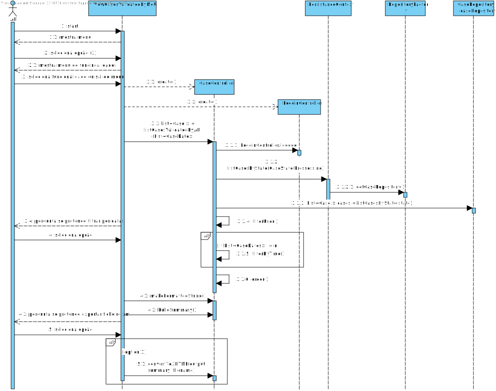

#Aluno 1170570 - AR05
##1. Requisitos
AR05. Como AR pretendo consultar os Pedidos de Avaliação de Risco por mim já validados.
• AR05.1. Os pedidos devem ser apresentados sempre ordenados dos mais recentes para os
mais antigos e deve ser indicado o tempo decorrido desde a atribuição até à sua conclusão.
• AR05.2. Permitir (opcionalmente) que os pedidos sejam filtrados para um dado período de
tempo.
• AR05.3. Deve ser apresentado um sumário (e.g. quantidade e tempo médio de análise) dos
pedidos apresentados.
• AR05.4. Permitir exportar o resultado da consulta (sumário incluído) para um documento
XHTML.

##3. Design

###3.1. Realização da Funcionalidade
####SD SE04

###3.2. Padrões Aplicados

###3.4. Testes

Teste 1: Verificar se consegue listar os cases que correspondem a duas especificações: ter caso PROCESSED e Estão atribuidos ao AR que está logado.

        @Test
        public void listCasesValidatedByAR() {
            System.out.println("listCasesValidatedByAR");
            CaseController instance = new CaseController();
            LoginController lc = new LoginController();
            lc.loginRiskAnalysis("1170570@gmail.com", "ola");
            List<CaseI> expResult = new ArrayList<>();
            expResult.add(instance6);
            expResult.add(instance5);
            expResult.add(instance4);
            List<CaseI> result = instance.listCasesValidatedByAR(null);
            assertEquals(expResult, result);
    	}

Teste 2: Mesmo teste que o Teste 1, embora desta vez com a funcionalidade opcional de filtrar casos criados entre duas datas

        @Test
        public void listCasesValidatedByARFilterByTime() {
            System.out.println("listCasesValidatedByARFilterByTime");
            CaseController instance = new CaseController();
            LoginController lc = new LoginController();
            lc.loginRiskAnalysis("1170570@gmail.com", "ola");
            List<CaseI> expResult = new ArrayList<>();
            expResult.add(instance5);
            expResult.add(instance4);
            List<CaseDate> list = new ArrayList<>();
            CaseDate date1 = new CaseDate("2004-01-01 00:00:00");
            CaseDate date2 = new CaseDate("2006-01-01 00:00:00");
            list.add(date1);
            list.add(date2);
            List<CaseI> result = instance.listCasesValidatedByAR(list);
            assertEquals(expResult, result);
        }

Teste 3: Verificar que a transformação ocorrida entre xml para json é bem feita.

        @Test
        public void makeFormatedString() {
            System.out.println("makeFormatedString");
            CaseController instance = new CaseController();
            List<CaseI> list = new ArrayList<>();
            list.add(instance6);
            list.add(instance5);
            list.add(instance4);
            String result = instance.makeFormatedString(list);
            String expResult = "Case id: code6 tempo decorrido: 3 days 0 hours 0 minutes and 0 seconds.\nCase id: code5 		  	tempo decorrido: 2 days 0 hours 0 minutes and 0 seconds.\nCase id: code4 tempo decorrido: 1 days 0 hours 0				minutes and 0 seconds.\n";
            assertEquals(expResult, result);
        }

Teste 4: Verifica se o sumário é bem construido.

        @Test
        public void buildSummary() {
            System.out.println("buildSummaryTest");
            LoginController lc = new LoginController();
            lc.loginRiskAnalysis("1170570@gmail.com", "ola");
            CaseController instance = new CaseController();
            List<CaseI> list = instance.listCasesValidatedByAR(null);
            instance.makeFormatedString(list);
            String result = instance.buildSummary();
            String expResult = "email= 1170570@gmail.com validated 3 Cases and took an average of 2 days 0 hours 0 minutes and		0 seconds.";
            assertEquals(expResult, result);
        }

Teste 5: Verificar se o ficheiro xhtml é criado

        @Test
        public void testTransformIntoXML() {
            System.out.println("transformIntoXML");
            LoginController lc = new LoginController();
            lc.loginRiskAnalysis("1170570@gmail.com", "ola");
            CaseController instance = new CaseController();
            List<CaseI> list = instance.listCasesValidatedByAR(null);
            String output = instance.makeFormatedString(list);
            String summary = instance.buildSummary();
            File expResult = new File("ar05XHTMLTest.xhtml");
            File result = instance.convertToXHTML(output, summary, "ar05XHTMLTest2");
            assertEquals(expResult.getFreeSpace(), result.getFreeSpace());
        }

##4. Implementação

+ Um AR logado acede ao UC.
+ É lhe apresentado um menu no qual tem de optar por filtrar os casos normalmente ou com o acrescimo da restrição de datas.
+ Após ser apresentado o resultado são apresentadas as opções de voltar para o menu (exit) ou exportar o output apresentado.

##5. Integration/Demonstration
+ Para esta uc foi necessário um estudo de como validar xmls, fazer transformaçoes etc.

##6. Observações

+ Deparei-me com dificuldades em transformar um ficheiro interédio xml em formato xhtml, uma vez que as tags não aparecem aquando a tranfomação
