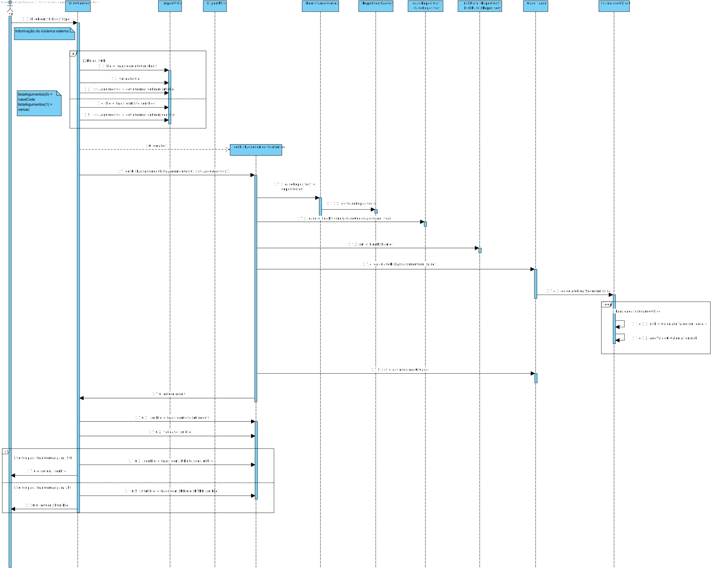
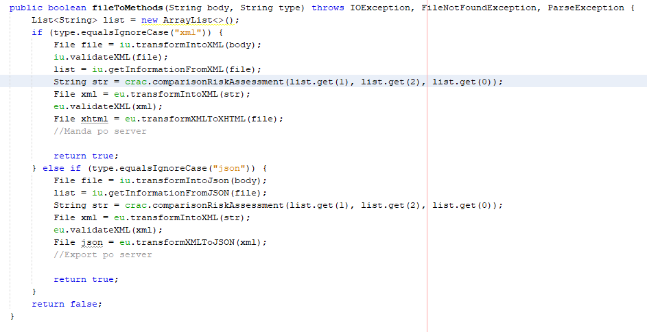
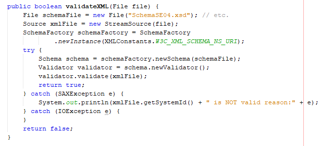
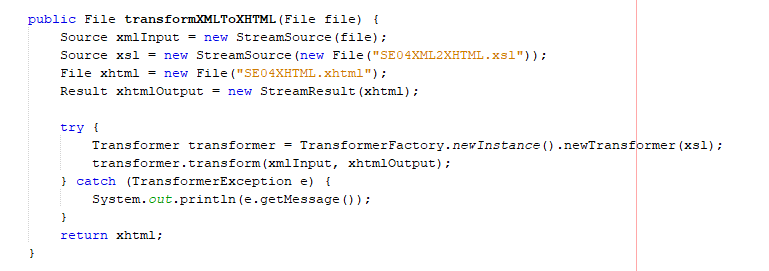

#Aluno 1170570 - SE02
##1. Requisitos
**SE02** - Como SE pretendo obter o resultado (final ou o status atual) de um Pedido de Avaliação de Risco
previamente submetido.

##2. Análise
 Esta funcionalidade pretende, através de um request HTTP que passa um ficheiro xml com os parametros, o promgrama acede ao core que vai buscar à base de dados o caso e a matriz de risco correspondente. Se o Pedido estiver com status final é calculado o indice de risco, devolvido em formato xhtml. Se o status não for final é devolvido o status em formato xhtml.

##3. Design

###3.1. Realização da Funcionalidade
####SD SE04

###3.2. Padrões Aplicados
+ Factory

###3.4. Testes

Teste 1: Verificar que a comparação de riscos retorna a devida string.

        @Test
        public void testGetRiskAssessment() {
            System.out.println("comparisonRiskAssessment");
            RiskMatrix rm = createMatrixTest();
            matrixRepository.save(rm);
            CaseI caase = createCaseTest();
            caseRepository.save(caase);
            String vers = "1";
            String caseCode = "Code";
            GetRiskAssessmentResultController instance = new GetRiskAssessmentResultController();
            String result = instance.getIntegerRiskIndex(caseCode, vers);
            String expResult = "\nName: Casa-> 76\nName: Telemóvel-> 76";
            assertEquals(expResult, result);
        }

Teste 2: Verificar que o xml input é verificado por um xsd.

        @Test
        public void testValidateXML() {
            System.out.println("validateXML");
            File file = new File("a.xml");
            ImportUtil instance = new ImportUtil();
            boolean result =instance.validateXML(file);
            boolean expResult = true;
            assertEquals(expResult, result);
		}

Teste 3: Verificar que a transformação ocorrida entre xml para json é bem feita.

		@Test
		public void testTransformXMLToJSON() throws Exception {
            System.out.println("transformXMLToJSON");
            File file = new File("SE04-Export2.xml");
            ExportUtil instance = new ExportUtil();
            File result = instance.transformXMLToJSON(file);
            File expResult = new File("SE04-Export2.json");
            assertEquals(expResult.getFreeSpace(),result.getFreeSpace());
		}

Teste 4: Verificar que a transformação ocorrida entre o body de um xml para xml é bem feita.

    @Test
    public void testTransformIntoXML() {
            System.out.println("transformIntoXML");
            String body = "\"\\nName: Casa\"\n" +
    "                + \"\\nPrimeira matriz apresenta 76\"\n" +
    "                + \"\\nSegunda matriz apresenta 58\"\n" +
    "                + \"\\nName: Telemovel\"\n" +
    "                + \"\\nPrimeira matriz apresenta 76\"\n" +
    "                + \"\\nSegunda matriz apresenta 58\"\n" +
    "                + \"\\nMatriz 2 tem melhor índice de risco\"";
            ExportUtil instance = new ExportUtil();
            File expResult = new File("SE04-Export2.xml");
            File result = instance.transformIntoXML(body);
            assertEquals(expResult.getFreeSpace(), result.getFreeSpace());
    }

Teste 5: Verificar que a receber um input de um xml retorna o devido ficheiros

    @Test
    public void testFileToMethodsXML() throws Exception {
            System.out.println("fileToMethods");
            FileReceiver fr = new FileReceiver();
            RiskMatrix rm = createMatrixTest();
            RiskMatrix rm2 = createMatrixTest2();
            matrixRepository.save(rm);
            matrixRepository.save(rm2);
            CaseI caase = createCaseTest();
            caseRepository.save(caase);
            String body = "<SE04>\\n\"\n" +
    "//                + \"\\n\"\n" +
    "//                + \"<CaseCode>Code</CaseCode>\\n\"\n" +
    "//                + \"\\n\"\n" +
    "//                + \"\\n\"\n" +
    "//                + \"<Versions>\\n\"\n" +
    "//                + \"\\n\"\n" +
    "//                + \"<Version>1</Version>\\n\"\n" +
    "//                + \"\\n\"\n" +
    "//                + \"<Version>2</Version>\\n\"\n" +
    "//                + \"\\n\"\n" +
    "//                + \"</Versions>\\n\"\n" +
    "//                + \"\\n\"\n" +
    "//                + \"</SE04>";
            String type = "xml";
            boolean b = fr.fileToMethods(body, type);
            assertEquals(true,b);
    }

##4. Implementação

+ Recebe-se o body de um ficheiro de o servvidor externo e o tipo de ficheiro.
+ O sistema só realiza a funcionalidade caso o ficheiro seja do tipo json ou xml

+ As validações e transformações dos ficheiros que vieram do server estão no ImportUtils.

+ As validações e transformações dos ficheiros que vão ser exportados para o servidor estão no ExportUtils.

+ Toda a Implementação foi feita com a maior eficiencia e modularidade possivel e  de acordo com o design efetuado,obedecendo  às regras de negocio e adotando o uso do padrão factory

##5. Integration/Demonstration
Nesta secção o estudante deve descrever os esforços realizados no sentido de integrar a funcionalidade desenvolvida com as restantes funcionalidades do sistema.
+ Para esta uc foi necessário um estudo de como validar xmls, fazer transformaçoes etc.. e também a conexão com um servidor.
+ Para integrar com as restantes funcionalidades do sistema foi necessário as devidas dependências e cuidado a seguir os padrões das restantes funcionalidades.

##6. Observações
Nesta secção sugere-se que o estudante apresente uma perspetiva critica sobre o trabalho desenvolvido apontando, por exemplo, outras alternativas e ou trabalhos futuros relacionados.

+ Utilização de ferramentas adequadas para transformações, validações e passagens de tipos de ficheiro para outros tipos de ficheiro.
