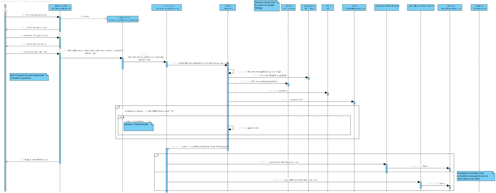

#GS-05 -> 1170570

## 1. Requisitos ##

SG05. Como SG pretendo obter a distância (em quilómetros) e tempo de viagem (em minutos) entre
duas localizações tendo em consideração a forma de deslocação (e.g. de automóvel, a pé).
• SG05.1. Esta informação deve ser obtida usando o serviço externo MBS.
• SG05.2. Esta informação deve ser obtida usando o serviço externo GMS.
• SG05.3. Esta informação deve ser obtida por combinação (i.e. distância e tempo médio) dos
resultados dos serviços externos anteriores.
• SG05.4. O sistema deve usar o método anterior que estiver configurado para o efeito

## Análise ##

 * O utilizador deverá escolher de que serviço externo pretende receber as informações (google maps, microsoft bing ou a média dos dois).
 * O utilizador deverá introduzir duas localizações.
 * A distancia em quilómetros e o tempo, tendo em conta o método de transporte, serão apresentados.

## 3.1. Realização da Funcionalidade

## 3.2. Padrões Aplicados

* Stratagy
* Builder

## 3.3. Testes
Os testes forama realizados de de acordo com os exemplos disponiveis e com auxilio das applicações Google Maps e Bing Maps

####**Testes relativos à class ExternalGeoRefServices**

* Google Maps Services

        /**
         * Test of obtainDistanceAndDuration method, of class ExternalGeoRefService.
         */
        @Test
        public void testObtainDistanceAndDurationGoogle() throws Exception, ParseException {
            System.out.println("testObtainDistanceAndDurationGoogle");
            String apiName = "google";
            String param = "origins=Vancouver+BC&destinations=San+Francisco&mode=bicycling";
            String type = "distancematrix";
            ExternalGeoRefService instance = new ExternalGeoRefService();
            int expMeters = 1706000;
            int resultMeters = (int) (instance.obtainDistanceAndDuration(apiName, param, type).get(0) * 1000);
            int expSeconds = 328800;
            int resultSeconds = (int) (instance.obtainDistanceAndDuration(apiName, param, type).get(1) * 60);
            assertEquals(expMeters, resultMeters);
            assertEquals(expSeconds, resultSeconds);

        }

* Microsoft Bing Services
        /**
         * Test of testObtainDistanceAndDuration method, of class ExternalGeoRefService.
         */
        @Test
        public void testObtainDistanceAndDurationMicrosoft() throws Exception {
            System.out.println("testObtainDistanceAndDurationMicrosoft");
            String apiName = "microsoft";
            String param = "origins=47.6044,-122.3345&destinations=45.5347,-122.6231&travelMode=driving";
            String type = "distancematrix";
            ExternalGeoRefService instance = new ExternalGeoRefService();
            int expMeters = 281546;
            int resultMeters = (int) (instance.obtainDistanceAndDuration(apiName, param, type).get(0) * 1000);
            int expSeconds = 9943;
            int resultSeconds = (int) (instance.obtainDistanceAndDuration(apiName, param, type).get(1) * 60);
            assertEquals(expMeters, resultMeters);
            assertEquals(expSeconds, resultSeconds);

        }

####**Testes relativos à class ExternalGeoRefServicesController**
* Google Maps Service
        /**
         * Test of testObtainDistanceAndDuration method, of class ExternalGeoRefServiceController.
         */
        @Test
        public void testObtainDistanceAndDurationGoogle() throws Exception, ParseException {
            System.out.println("testObtainDistanceAndDurationGoogle");
            String apiName = "google";
            String address1 = "Avenida+dos+Aliados,+Porto";
            String address2 = "Av.+Dr.+Fernando+Aroso,+Matosinhos";
            String type = "distancematrix";
            ExternalGeoRefServiceController instance = new ExternalGeoRefServiceController();
            List<Double> result = instance.obtainDistanceAndDuration(apiName, address1, address2, "driving", type);
            int resultMeters = (int) (result.get(0) * 1000);
            int resultSeconds = (int) (result.get(1) * 60);
            int expMeters = 12000;
            int expSeconds = 900;
            assertEquals(expMeters, resultMeters);
            assertEquals(expSeconds, resultSeconds);

        }
* Microsoft Bing Service
		/**
         * Test of testObtainDistanceAndDuration method, of class ExternalGeoRefServiceController.
         */
        @Test
        public void testObtainDistanceAndDurationControllerMicrosoft() throws Exception {
            System.out.println("testObtainDistanceAndDurationControllerMicrosoft");
            String apiName = "microsoft";
            String address1 = "Avenida+dos+Aliados,+Porto";
            String address2 = "Av.+Dr.+Fernando+Aroso,+Matosinhos";
            String type = "distancematrix";
            ExternalGeoRefServiceController instance = new ExternalGeoRefServiceController();
            List<Double> result = instance.obtainDistanceAndDuration(apiName, address1, address2, "driving", type);
            int resultMeters = (int) (result.get(0) * 1000);
            int resultSeconds = (int) (result.get(1) * 60);
            int expMeters = 13147;
            int expSeconds = 1057;
            assertEquals(expMeters, resultMeters);
            assertEquals(expSeconds, resultSeconds);

        }
* Ambos os Serviços
        /**
         * Test of testObtainDistanceAndDurationController method, of class ExternalGeoRefServiceController.
         */
        @Test
        public void testObtainDistanceAndDurationBothServices() throws Exception {
            System.out.println("testObtainDistanceAndDurationBothServices");
            String apiName = "both";
            String type = "distancematrix";
            ExternalGeoRefServiceController instance = new ExternalGeoRefServiceController();
            String address1 = "Avenida+dos+Aliados,+Porto";
            String address2 = "Av.+Dr.+Fernando+Aroso,+Matosinhos";
            String mode = "driving";
            List<Double> result = instance.obtainDistanceAndDuration(apiName, address1, address2, mode, type);
            int resultMeters = (int) (result.get(0) * 1000);
            int resultSeconds = (int) (result.get(1) * 60);
            int expMeters = 18573;
            int expSeconds = 1428;
            assertEquals(expMeters, resultMeters);
            assertEquals(expSeconds, resultSeconds);

        }
* Especificador de Serviço Incorreto
        /**
         * Test of testObtainDistanceAndDurationController method, of class ExternalGeoRefServiceController.
         */
        @Test
        public void testObtainDistanceAndDurationWrongApiName() throws Exception {
            System.out.println("testObtainDistanceAndDurationWrongApiName");
            String apiName = "bla";
            String type = "distancematrix";
            ExternalGeoRefServiceController instance = new ExternalGeoRefServiceController();
            String address1 = "Avenida+dos+Aliados,+Porto";
            String address2 = "Av.+Dr.+Fernando+Aroso,+Matosinhos";
            String mode = "driving";
            List<Double> result = instance.obtainDistanceAndDuration(apiName, address1, address2, mode, type);
            assertNull(result);

        }

# 4. Implementação

A Implementção passa por contruir um endereço URL, que vai ser usado para fazer a conecção com as API atravez de um REST Service. Posteriormente a API retorna um texto com formato json que é lido para o programa e de seguida interpretado de forma a obter um JSONObject, que pode ser lido de forma a obter os resultados pretendidos.

# 5. Integration/Demonstration

### Google Maps Service
A implementação referente à API da google foi relativamente simples, a própria aplicação consegue interpretar varios tipos de localizações (moradas, códigos de postal, cidades, coordenadas). Foi cridado um controller onde é construido o URL que vai ser enviado para a API da google. Esta por vez retorna um ficheiro JSON que é lido na class ExternalGeoRefervice
### Microsoft Bing Service
A implementação relativa à API da microsoft foi mais complicada, uma vez que neste sprint não foi criado uma class para formatar em URL os parametros relativos ao endereço, conseguindo apenas testar o serviço que, que funciona perfeitamente, mas não o controller
###Média das duas aplicações
Uma vex que a implementação do serviço da microsoft foi completa, a implementação desta funcionalidade foi relativamente simples, tendo apenas de fazer a média dos valores obtidos pelos dois serviços.

# 6. Observações

O trabalho está funcional e completo, embora tenha necessitado de mais dois dias depois do prazo.