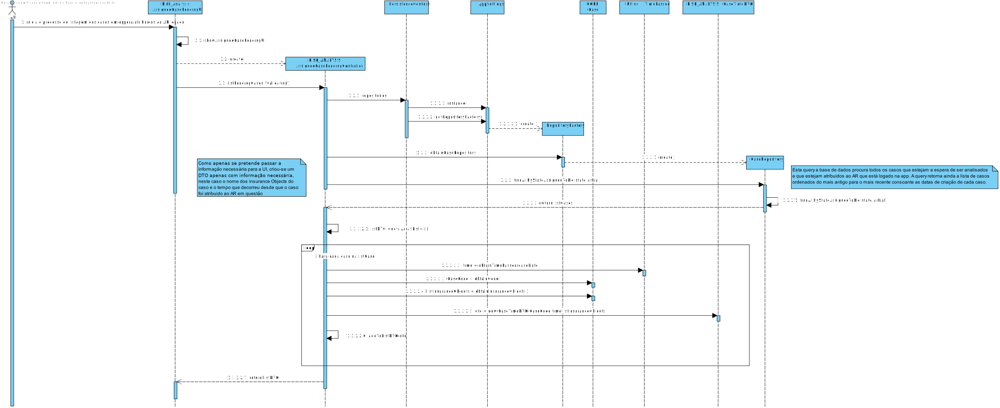

** [1170689](../)** - AR03
=======================================

# 1. Requisitos

+ AR03. Como AR pretendo consultar os meus (i.e. a mim atribuídos) Pedidos de Avaliação de Risco
pendentes de validação.
        AR03.1. Os pedidos devem ser apresentados sempre ordenados dos mais antigos para os mais
recentes e deve ser indicado o tempo decorrido desde a sua atribuição.
        AR03.2. Permitir que o AR inicie a análise dum dos Pedidos de Avaliação de Risco pendentes
(i.e. espoletar o requisito AR04).

A interpretação feita deste requisito foi de que é necessário mostrar ao AR que está a realizar a consulta, todos os casos que apresentando um estado de validating, que estejam associados ao AR que está a fazer a consulta. Estes dados são apresentados ordenados dos mais antigos para os mais recentes em relação à data de criação do caso. É ainda demonstrado o tempo que passou desde que o caso foi atribuído ao respetivo AR. Este menu apresenta ainda a hipótese de iniciar a análise de um caso(espoletar o requisito AR04).

=====================================================================

# 2. Análise

*Neste secção o estudante deve relatar o estudo/análise/comparação que fez com o intuito de tomar as melhores opções de design para a funcionalidade bem como aplicar diagramas/artefactos de análise adequados.*

• Este caso de uso será implementado no módulo Risk Analisys uma vez que o ator deste US é o AR. Não obstante, são realizados pedidos para outros módulos, nomeadamente o CORE (RABL).
• Seria ideal implementar o padrão state no caso, mas tal não foi possível, pois este problema foi detetado tardiamente e não houve tempo para as devidas alterações.
• O objetivo deste caso de uso é listar todos os casos em estado de espera de análise e que estejam atribuídos ao AR que está a realizar a consulta.
• Para isto, o Analista de Risco,AR, terá de estar logado no sistema e de ter casos atribuídos.

=====================================================================

# 3. Design

## 3.1. Realização da Funcionalidade

+ Para este caso de uso necessitamos de:

            +criterios de filtragem: estado do caso, o email do Analista de Risco,as datas de criação do caso e a data de atribuição do caso ao Analista de Risco.
            + Precisamos de verificar se os pedidos estão ou não concluídos.
            + obter os casos para os parametros enviados: estado do caso, email do Analista de Risco e ordenar pela data de criação do Caso.

## 3.2. Diagrama de Sequência

####SD AR03

## 3.3. Padrões/Princípios Aplicados

+ Repository
+ Factory
+ DTO
+ GRASP
+ SOLID

## 3.4. Testes

+ Para este UC, o teste principal foi adicionar 3 casos em estado validating e com o utilizador associado ao que estava logado no sistema e esperar 3 CaseTimeDtos. Este teste testa principalmente se são retornados os casos em estado validating, associados ao user e pela ordem pretendida. Testa-se ainda se são criados os DTOs da maneira correta

      @Test
      public void testListPendingCases() throws Exception {
        System.out.println("listPendingCases");
        CaseState s = CaseState.VALIDATING;
        AssignedCasesController instance = new AssignedCasesController();
        List<CaseTimeDTO> expResult = new ArrayList<>();
        CaseTimeDTO dto1 = new CaseTimeDTO("code3", "00:00:06", new ArrayList<>());
        CaseTimeDTO dto2 = new CaseTimeDTO("code1", "00:00:10", new ArrayList<>());
        CaseTimeDTO dto3 = new CaseTimeDTO("code2", "00:00:10", new ArrayList<>());
        expResult.add(dto1);
        expResult.add(dto2);
        expResult.add(dto3);
        List<CaseTimeDTO> result = instance.listPendingCases(s);
        assertEquals(expResult.get(0).CaseCode, result.get(0).CaseCode);
        assertEquals(expResult.get(0).listInsurances, result.get(0).listInsurances);
        assertEquals(expResult.get(1).CaseCode, result.get(1).CaseCode);
        assertEquals(expResult.get(1).listInsurances, result.get(1).listInsurances);
        assertEquals(expResult.get(2).CaseCode, result.get(2).CaseCode);
        assertEquals(expResult.get(2).listInsurances, result.get(2).listInsurances);   
      }

    + Teste para verificar o tempo que passou duma determinada data até ao momento. Para poder testar este teste, teve de se comparar a data atual à data atual, pois é impossível de testar o tempo passado de uma determinada data até ao momento pois vai sempre aumentando:

          @Test
          public void testTimePassed() throws Exception {
            System.out.println("TimePassed");
            Date now = new Date();
            SimpleDateFormat formatter = new SimpleDateFormat("dd-MM-yyyy HH:mm:ss");
            String cd = formatter.format(now);
            boolean flag = false;
            String result = TimePassed.TimePassed(cd);
            if (!result.equalsIgnoreCase("")) {
              if (result.equalsIgnoreCase("01:00:00") || result.equalsIgnoreCase("01:00:01") || result.equalsIgnoreCase("0:00:00") || result.equalsIgnoreCase("00:00:01")) {
                flag=true;
              }
            }
            assertEquals(true, flag);
          }     

=====================================================================

# 4. Implementação

*Nesta secção o estudante deve providenciar, se necessário, algumas evidências de que a implementação está em conformidade com o design efetuado. Para além disso, deve mencionar/descrever a existência de outros ficheiros (e.g. de configuração) relevantes e destacar commits relevantes;*

+ Para este UC foi criada uma UI para facilitar a interação entre o analista de risco e o sistema.
+ para tal o sistema utiliza o estado para procurar(Validating), procurando todos os casos com esse estado e atribuídos ao AR que está logado.
+ Apoós isto, os dados são mostrados ao Ar.
+ O Ar tem ainda a opção de escolher um caso e começar a análise a um dos casos disponíveis.

      public List<CaseTimeDTO> listPendingCases(CaseState s) throws ParseException {
        List<CaseI> i = PersistenceContext.repositories().caseRepository().findAllByStateAssignedToMe(s, LoginController.logged.identity());
        List<CaseTimeDTO> listDTO = new ArrayList<>();
        for (CaseI c : i) {
          List<String> insuranceNames = new ArrayList<>();
          for(InsuranceObject io : c.getAssociatedInsuranceObjects()){
            insuranceNames.add(io.obtainName());
          }
          String str = TimePassed.TimePassed(c.obtainLastUpdatedDate());
          listDTO.add(new  CaseTimeDTO(c.obtainCode(),str,insuranceNames) );
        }
        return listDTO;
      }

Implementação da classe CaseTimeDTO:

    public class CaseTimeDTO implements Serializable{

    public String CaseCode;

    public String timePassed;

    public List<String> listInsurances;

    /**
     * CaseTimeDTO Constructor
     */
    public CaseTimeDTO(){
        CaseCode = "";
        timePassed="";
        listInsurances=new ArrayList<>();
    }

    /**
     * CaseTimeDTO Constructor
     * @param caseCode
     * @param timePassed
     */
    public CaseTimeDTO(String caseCode, String timePassed, List<String> insuranceNames){
        this.CaseCode=caseCode;
        this.timePassed=timePassed;
        this.listInsurances = insuranceNames;
    }

}

=====================================================================

# 5. Integration/Demonstration

*Nesta secção o estudante deve descrever os esforços realizados no sentido de integrar a funcionalidade desenvolvida com as restantes funcionalidades do sistema.*

+ Para a realização deste UC, houve uma necessidade de compreender como funcionava as queries para obter resultados do jpa, de compreender o uso de DTOs, importantes para passar apenas a informação necessária para a UI.
+ Esta funcionalidade é importante, pois o AR apenas consegue inicializar uma análise de um caso, sabendo quais são os casos que estão à espera de ser analisados e que estão atribuídos ao mesmo AR.

=====================================================================

# 6. Observações

*Nesta secção sugere-se que o estudante apresente uma perspetiva critica sobre o trabalho desenvolvido apontando, por exemplo, outras alternativas e ou trabalhos futuros relacionados.*

+ Esta semana, o trabalho foi realizado com todos os requisitos necessários. O trabalho foi realizado tendo em vista o que foi aprendido em EAPLI, tal como o uso de DTOs para passar a informação necessária para o utilizador, na obtenção de informação da base de dados, a informação foi tratada toda na querie não tendo ir buscar todos os objetos e depois tratar a informação tal como era pretendido, tendo sim de uma maneira mais correta, logo na querie trazer apenas os objetos que correspondiam aos critérios pretendidos, tendo como por exemplo, a ordenação feita na querie.

+ A funcionalidade foi implementada respeitando as regras de negocio, uso de padrões, modularidade e simplicidade na realização das tarefas.
