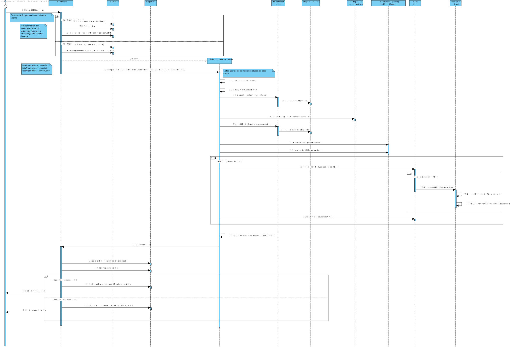
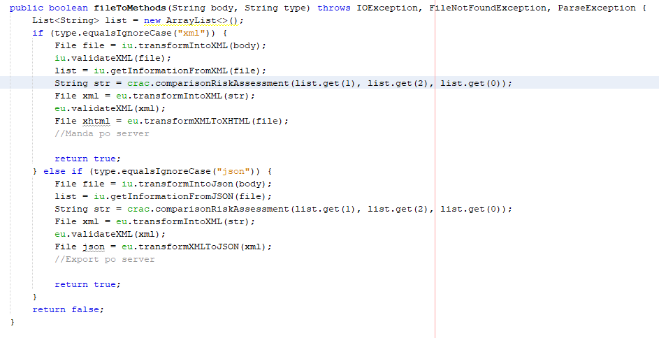
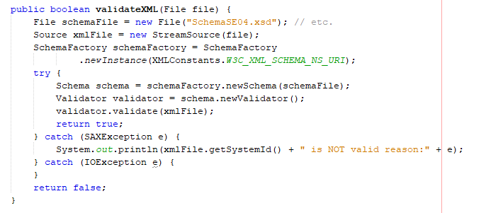
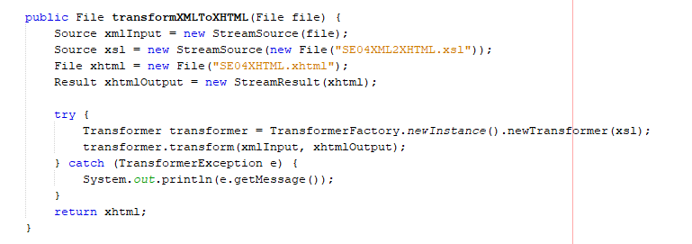

#Aluno 1170688 - SE04
##1. Requisitos
**SE04** - Como SE pretendo solicitar uma Comparação de Avaliação de Risco usando duas matrizes de
risco distintas para um dado local e respetivo conjunto de coberturas.

##2. Análise
+ Este caso de uso terá de ser implementado no módulo RISK ASSESSMENT pois trata-se de uma user story do Sistem Externo. No entanto, vai interagir com o módulo CORE pois requer regras de negócio que estão neste implementadas.
+ Este UC terá de fazer uma pesquisa na base de dados do risk matrix e do caso.
	+ Esta pesquisa poderá ter condições (versão de uma determinada matriz).
+ O pedido é feito através de um request http, resultando num ficheiro xml ou json e exportado o resultado do pedido em xml,json ou xhtml.
+ Realizar um pedido de avaliação de risco é obter o  resultado da avaliação de risco bem como o detalhe de quais foram os fatores considerados no caso e a sua influência no cálculo final.
+ O resultado da avaliação de risco bem como o detalhe de quais foram os fatores considerados no caso e a sua influência no cálculo final são registados no sistema de forma a potenciar a realização de outros processos (e.g. processo de verificação/validação dos resultados gerados automaticamente por analistas de risco e processos de auditoria).
+ Compara-se os diferentes resultados da avaliação de risco de 2 versões de matrizes com a mesma loalização e um respetivo conjunto de coberturas.

##3. Design

Nesta secção o estudante deve descrever o design adotado para satisfazer a funcionalidade. Entre outros, o estudante deve apresentar diagrama(s) de realização da funcionalidade, diagrama(s) de classes, identificação de padrões aplicados e quais foram os principais testes especificados para validar a funcionalidade.

Para além das secções sugeridas, podem ser incluídas outras.

###3.1. Realização da Funcionalidade
####SD SE04

###3.2. Diagrama de Classes

+ **RISK ASSESSMENT WEB SERVER:**
	+ ComparisonRiskAssessmentController
	+ ImportUtil
  + ExportUtil
	+ File Receiver
+ **CORE:**
	+ PersistenceContext
	+ RepositoryFactory
	+ CaseRepository
  + MatrixRepository
  + CaseI
  + InsuranceObject
	+ RiskMatrix

###3.3. Padrões Aplicados
+ Factory

###3.4. Testes
Nesta secção deve sistematizar como os testes foram concebidos para permitir uma correta aferição da satisfação dos requisitos.

Teste 1: Verificar que a comparação de riscos retorna a devida string.

    @Test
    public void testComparisonRiskAssessment() {
        System.out.println("comparisonRiskAssessment");
        RiskMatrix rm = createMatrixTest();
        RiskMatrix rm2 = createMatrixTest2();
        matrixRepository.save(rm);
        matrixRepository.save(rm2);
        CaseI caase = createCaseTest();
        caseRepository.save(caase);
        String vers1 = "1";
        String vers2 = "2";
        String caseCode = "Code";
        ComparisonRiskAssessmentController instance = new ComparisonRiskAssessmentController();
        String result = instance.comparisonRiskAssessment(vers1, vers2, caseCode);
        String expResult = "\nName: Casa"
                + "\nPrimeira matriz apresenta 76"
                + "\nSegunda matriz apresenta 58"
                + "\nName: Telemóvel"
                + "\nPrimeira matriz apresenta 76"
                + "\nSegunda matriz apresenta 58"
                + "\nMatriz 2 tem melhor indice de risco";
        System.out.println(result);
        assertEquals(expResult, result);
    }

Teste 2: Verificar que o xml input é verificado por um xsd.

@Test
    public void testValidateXML() {
        System.out.println("validateXML");
        File file = new File("a.xml");
        ImportUtil instance = new ImportUtil();
        boolean result =instance.validateXML(file);
        boolean expResult = true;
        assertEquals(expResult, result);

Teste 3: Verificar que a transformação ocorrida entre xml para json é bem feita.

@Test
public void testTransformXMLToJSON() throws Exception {
		System.out.println("transformXMLToJSON");
		File file = new File("SE04-Export2.xml");
		ExportUtil instance = new ExportUtil();
		File result = instance.transformXMLToJSON(file);
		File expResult = new File("SE04-Export2.json");
		assertEquals(expResult.getFreeSpace(),result.getFreeSpace());
}

Teste 4: Verificar que a transformação ocorrida entre o body de um xml para xml é bem feita.

@Test
public void testTransformIntoXML() {
		System.out.println("transformIntoXML");
		String body = "\"\\nName: Casa\"\n" +
"                + \"\\nPrimeira matriz apresenta 76\"\n" +
"                + \"\\nSegunda matriz apresenta 58\"\n" +
"                + \"\\nName: Telemovel\"\n" +
"                + \"\\nPrimeira matriz apresenta 76\"\n" +
"                + \"\\nSegunda matriz apresenta 58\"\n" +
"                + \"\\nMatriz 2 tem melhor índice de risco\"";
		ExportUtil instance = new ExportUtil();
		File expResult = new File("SE04-Export2.xml");
		File result = instance.transformIntoXML(body);
		assertEquals(expResult.getFreeSpace(), result.getFreeSpace());
}

Teste 5: Verificar que a receber um input de um xml retorna o devido ficheiros

@Test
public void testFileToMethodsXML() throws Exception {
		System.out.println("fileToMethods");
		FileReceiver fr = new FileReceiver();
		RiskMatrix rm = createMatrixTest();
		RiskMatrix rm2 = createMatrixTest2();
		matrixRepository.save(rm);
		matrixRepository.save(rm2);
		CaseI caase = createCaseTest();
		caseRepository.save(caase);
		String body = "<SE04>\\n\"\n" +
"//                + \"\\n\"\n" +
"//                + \"<CaseCode>Code</CaseCode>\\n\"\n" +
"//                + \"\\n\"\n" +
"//                + \"\\n\"\n" +
"//                + \"<Versions>\\n\"\n" +
"//                + \"\\n\"\n" +
"//                + \"<Version>1</Version>\\n\"\n" +
"//                + \"\\n\"\n" +
"//                + \"<Version>2</Version>\\n\"\n" +
"//                + \"\\n\"\n" +
"//                + \"</Versions>\\n\"\n" +
"//                + \"\\n\"\n" +
"//                + \"</SE04>";
		String type = "xml";
		boolean b = fr.fileToMethods(body, type);
		assertEquals(true,b);
}

##4. Implementação
Nesta secção o estudante deve providenciar, se necessário, algumas evidências de que a implementação está em conformidade com o design efetuado. Para além disso, deve mencionar/descrever a existência de outros ficheiros (e.g. de configuração) relevantes e destacar commits relevantes;

+ Recebe-se o body de um ficheiro de o servvidor externo e o tipo de ficheiro.
+ O sistema só realiza a funcionalidade caso o ficheiro seja do tipo json ou xml

+ As validações e transformações dos ficheiros que vieram do server estão no ImportUtils.

+ As validações e transformações dos ficheiros que vão ser exportados para o servidor estão no ExportUtils.

+ Toda a Implementação foi feita com a maior eficiencia e modularidade possivel e  de acordo com o design efetuado,obedecendo  às regras de negocio e adotando o uso do padrão factory

##5. Integration/Demonstration
Nesta secção o estudante deve descrever os esforços realizados no sentido de integrar a funcionalidade desenvolvida com as restantes funcionalidades do sistema.
+ Para esta uc foi necessário um estudo de como validar xmls, fazer transformaçoes etc.. e também a conexão com um servidor.
+ Para integrar com as restantes funcionalidades do sistema foi necessário as devidas dependências e cuidado a seguir os padrões das restantes funcionalidades.

##6. Observações
Nesta secção sugere-se que o estudante apresente uma perspetiva critica sobre o trabalho desenvolvido apontando, por exemplo, outras alternativas e ou trabalhos futuros relacionados.

+ Utilização de ferramentas adequadas para transformações, validações e passagens de tipos de ficheiro para outros tipos de ficheiro.
