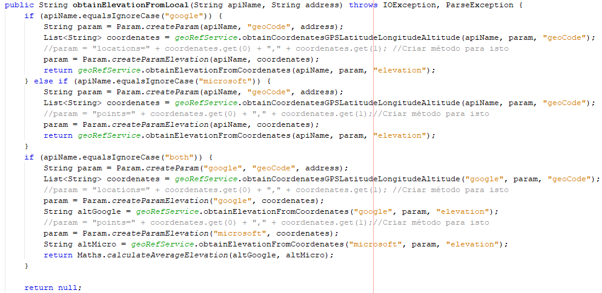

#Aluno 1170689 - SG04
=======================================

# 1. Requisitos

SG04. Como SG pretendo obter a elevação (em metros) relativamente ao nível médio da água do mar
de um determinado local.
• SG04.1. Esta informação deve ser obtida usando o serviço externo MBS.
• SG04.2. Esta informação deve ser obtida usando o serviço externo GMS.
• SG04.3. Esta informação deve ser obtida por combinação (i.e. valor médio) dos resultados dos
serviços externos anteriores.
• SG04.4. O sistema deve usar o método anterior que estiver configurado para o efeito.

=====================================================================

# 2. Análise

*Neste secção o estudante deve relatar o estudo/análise/comparação que fez com o intuito de tomar as melhores opções de design para a funcionalidade bem como aplicar diagramas/artefactos de análise adequados.*

• Este caso de uso terá de ser implementado no módulo EXTERNAL GEOREFERENCE SERIVCE pois trata-se de uma user story do Serviço Georreferenciação .
• O objetivo deste caso de uso é indicar a elevação (em metros) relativamente ao nível médio da água do mar de um determinado local. A obtenção da informação necessária será suportada pelo uso de duas APIs (MBS e GMS), onde o Serviço de GeoReferência dará a escolha as duas APIs ou mesmo o uso das duas e de seguida fazendo uma média dos resultados obtidos, para a operação se realizar.
• Para esta operação será recebido como input um identificador da API escolhida e uma string com os dados de um endereço postal de uma localização(não sendo necessário que tenha a informação toda).
• Dado isto, necessitamos de um http request realizado pelo URL para ser estabelecida a ligação com a API selecionada anteriormente.
• A informação introduzida anteriormente será  enviado para a api com o http request  o retorno será a altitude do local.
• Primeiramente, obtém-se as coordenadas a partir do input introduzido e posteriormente através destas coordenadas obtém-se a altitude para o local pretendido.

=====================================================================

# 3. Design

+ Necessitamos de um http request realizado pelo Url para ser estabelecida a ligação com a API fornecida.

+ Uma query com parametros para a API receber a informação necessária.
+ Realizada uma coneção para "pedir" um ficheiro json com os dados para um certo endereço postal.

## 3.1. Realização da Funcionalidade

*Nesta secção deve apresentar e descrever o fluxo/sequência que permite realizar a funcionalidade.*

## 3.2. Diagrama de Classes

## 3.3. Padrões Aplicados

+ Strategy (aplicado no tratamento do url para o GMS e MBS);
+ Builder(aplicado para contruir o JsonObject ,e para a Location);

## 3.4. Testes
**Teste 1.0:** Verificar que é possivel criar uma chave conforme a sua source valida.

    @Test
    public void constructorValide() {
    k = new Key("4545-4545-4545-4545", "google");
    }

**Teste 1.1:** Verificar que não é possivel criar uma chave 12 numeros

    @Test(expected = IllegalArgumentException.class)
    public void constructorInvalide3Times() {
    k = new Key("4545-4545-4545", "google");
    }

**Teste 2:** Testar a obtenção da elevação usando a api da google

/**
 * Test of obtainElevationFromLocal method, of class ExternalGeoRefServiceController.
 */
@Test
public void testObtainElevationFromLocalGoogle() throws Exception {
    System.out.println("obtainElevationFromLocal");
    String apiName = "google";
    String address = "431,Rua Doutor Antonio Bernardino de Almeida";
    ExternalGeoRefServiceController instance = new ExternalGeoRefServiceController();
    String expResult = "106.1256256103516";
    String result = instance.obtainElevationFromLocal(apiName, address);
    assertEquals(expResult, result);
}

**Teste 3:** Testar a obtenção da elevação usando a api da microsoft

/**
* Test of obtainElevationFromLocal method, of class ExternalGeoRefServiceController.
*/
@Test
public void testObtainElevationFromLocalMicrosoft() throws Exception {
System.out.println("obtainElevationFromLocal");
String apiName = "microsoft";
String address = "431,Rua Doutor Antonio Bernardino de Almeida";
ExternalGeoRefServiceController instance = new ExternalGeoRefServiceController();
String expResult = "109";
String result = instance.obtainElevationFromLocal(apiName, address);
assertEquals(expResult, result);
}

**Teste 4:** Testar a obtenção da elevação usando as duas apis e fazendo uma média

/**
* Test of obtainElevationFromLocal method, of class ExternalGeoRefServiceController.
*/
@Test
public void testObtainElevationFromLocalBoth() throws Exception {
System.out.println("obtainElevationFromLocal");
String apiName = "both";
String address = "431,Rua Doutor Antonio Bernardino de Almeida";
ExternalGeoRefServiceController instance = new ExternalGeoRefServiceController();
String expResult = "107.56281280517581";
String result = instance.obtainElevationFromLocal(apiName, address);
assertEquals(expResult, result);
}

=====================================================================

# 4. Implementação

*Nesta secção o estudante deve providenciar, se necessário, algumas evidências de que a implementação está em conformidade com o design efetuado. Para além disso, deve mencionar/descrever a existência de outros ficheiros (e.g. de configuração) relevantes e destacar commits relevantes;*

+ Apenas faria sentido obter dados da API caso o URL e HTTP forem validos.
+ O sistema só continua o metodo caso o Url seja valido.

+ Keys das apis  encontram-se nas keys.properties
+ A obtenção do Url (por exemplo da google) é composta pelo Url inicial onde no fim é colocado o tipo de ficheiro pretendido, neste caso json.
+ Os parametros para cada metodo são adicionados.
+ A key obtida noutro metodo tambem é adicionado ao Url completando assim um url valido.

+ Recebendo o endereço que quer obter a elevação, o sistema retorna a elevação, para qualquer uma das opções da api(google,microsoft ou uma média das duas).

+ Exemplo da transformação dos valores das coordenadas obtidas através do endereço, a criação do parâmetro necessário para a pesquisa da elevação.

+ toda a Implementação foi feita com a maior eficiencia e modularidade possivel e  de acordo com o design efetuado,obedecendo  às regras de negocio e adotando o uso de padroe:builder e stratagy

=====================================================================

# 5. Integration/Demonstration

*Nesta secção o estudante deve descrever os esforços realizados no sentido de integrar a funcionalidade desenvolvida com as restantes funcionalidades do sistema.*

+ Para esta UC tive de perceber como funcionavam as apis, parametros que recebia e o seu retorno, bem como a conexão as mesmas.
+ Para a realização desta UC foi ainda necessário entender como tratar ficheiros json, e como tratá-los da melhor maneira.

=====================================================================

# 6. Observações

*Nesta secção sugere-se que o estudante apresente uma perspetiva critica sobre o trabalho desenvolvido apontando, por exemplo, outras alternativas e ou trabalhos futuros relacionados.*

+ ponto a melhorar: utilização do padrão adapter neste conjunto de casos de uso pertencentes ao Serviço de GeoReferencia.
+ Caso de Uso implementado com o maximo de efificiência e modularidade possivel.
