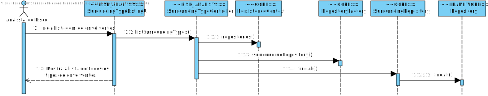
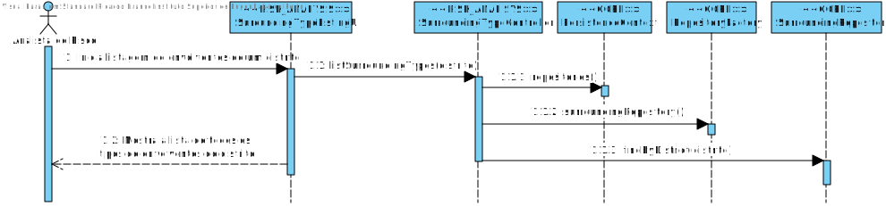
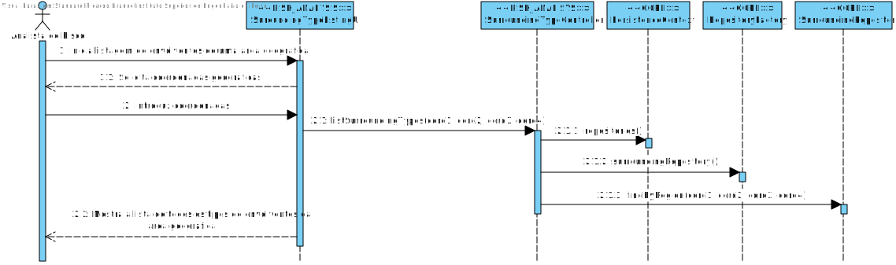
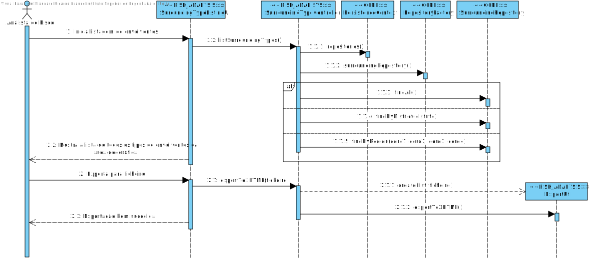

#Aluno 1171173 - AR07
##1. Requisitos
**AR07** - Como AR pretendo obter uma listagem das envolventes registadas no sistema.

    AR07.1. - A listagem deve estar organizada por tipo de envolvente (e.g. Bombeiros, Hospitais).

    AR07.2. - Permitir filtrar a listagem para esta incluir apenas envolventes de um determinado distrito.
    
    AR07.3. - Permitir filtrar a listagem para esta incluir apenas envolventes localizadas numa área geográfica retangular arbitrariamente definida pelo AR (i.e. através de um conjunto de coordenadas GPS).
    
    AR07.4. - Permitir exportar o resultado da listagem para um documento XHTML.
    
##2. Análise
+ Este caso de uso terá de ser implementado no módulo RISK ANALYSIS pois trata-se de uma user story do Analista de Risco. No entanto, vai interagir com o módulo CORE pois requer regras de negócio que estão neste implementadas.
+ Este UC terá de fazer uma pesquisa na base de dados dos envolventes.
	+ Esta pesquisa poderá ter condições (distrito, dentro de uma área geográfica).
+ Os resultados poderam ter de ser exportados para um ficheiro XHTML.
	+ Implica transformações para XHTML.

##3. Design

###3.1. Realização da Funcionalidade
####SD AR07.1

####SD AR07.2

####SD AR07.3

####SD AR07.4

###3.2. Diagrama de Classes
+ **RISK ANALYSIS:**
	+ SurroundingTypeUI
	+ SurroundingTypeController
	+ ExportUtil
+ **CORE:**
	+ PersistenceContext
	+ RepositoryFactory
	+ SurroundingRepository

###3.3. Padrões Aplicados
+ Repository Factory

###3.4. Testes

+ ####AR07.1
	Teste 1: Verificar se todos os tipos de envolvente são listados.
    
+ ####AR07.2
	Teste 1: Verificar se todos os tipos envolventes de um distrito são listados;
    Teste 2: Verificar se, introduzindo um distrito sem envolventes, nenhum é listado;
    Teste 3: Verificar se, não introduzindo um distrito, uma mensagem adequada é mostrada.
    
+ ####AR07.3
	Teste 1: Verificar se todos os tipos envolventes de uma área são listados;
    Teste 2: Verificar se, introduzindo uma área sem envolventes, nenhum é listado;
    Teste 3: Verificar se, não introduzindo uma coordenada, uma mensagem adequada é mostrada.

##4. Implementação

Foi necessário um refactor dos objetos Location e Surrounding, pois como vinham de EAPLI, era impossível cumprirem os requisitos do novo sistema.

##5. Integration/Demonstration

Foi criada uma User Interface invocada através de um menu principal que permite escolher as opções de listagem (tudo, distrito, área geográfica) e exportar.

##6. Observações

As querys de JPA de busca por coordenadas não ficaram a funcionar.
A transformação de XML para XHTML não está correta.