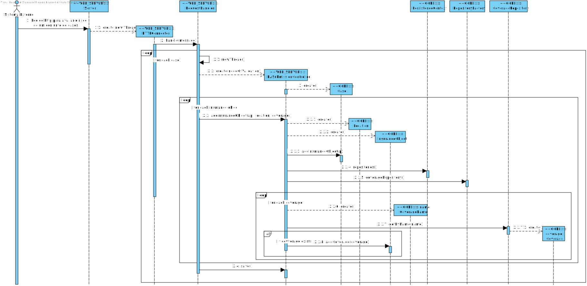

#Aluno 1171173 - SE05
##1. Requisitos
**SE05** - Como SE pretendo submeter de uma só vez um conjunto de Pedidos de Avaliação de Risco que devem ser tratados de forma conjunta.

Critério de Aceitação: O processamento destas solicitações deve ocorrer com uma prioridade mínima relativamente ao processamento das restantes solicitações.
    
##2. Análise
+ Este caso de uso será implementado no módulo RISK ASSESSEMENT WEBSERVER uma vez que o ator deste US é o sisterma externo. No entanto o módulo irá recorrer ao módulo RISK APP, que fará a análise necessária.
+ O pedido só será aceite, caso o token recebido seja reconhecido pelo sistema.
+ Uma vez que o pedido ficará registado no sistema, o método HTTP usado será PUT.
+ Serão precisas várias transformações XSLT para XML, XHTML e JSON.

##3. Design

###3.1. Realização da Funcionalidade
####SD SE05

###3.2. Diagrama de Classes
+ WEB SERVER:
	+ HTTPConnector
	+ RequestHandler (interface)
	+ MultipleSubmissionRequestHandler
	+ RASubmissionController
	+ ProcessRequest
+ CORE:
	+ PersistenceContext
	+ RepositoryFctory
	+ CoverageRepository
	+ CoverageName
	+ Coverage
	+ InsuranceObject
	+ Location
	+ Case

###3.3. Padrões Aplicados
+ Repository Factory

###3.4. Testes
+ Verificar se enviando o conteúdo correto com o URI certo, a mensagem HTTP correta é devolvida:
		@Test
	    public void testHandle_create() {
        	HTTPmessage request = new HTTPmessage();
        	request.setContentFromFile("MultipleSubmissionTest.xml");
        	request.setURI("/riskAssessment/cases/submit/multiple");
        	request.setRequestMethod("PUT");
        	request.setHeader("Authorization", "kuibjkhsabewfhjkuifu73g38wshgfilu");
        	MultipleRASubmissionRequestHandler instance = new MultipleRASubmissionRequestHandler();
        	HTTPmessage expResult = new HTTPmessage();
        	expResult.setResponseStatus(Config.CREATED);
        	HTTPmessage result = instance.handle(request);
        	assertEquals(expResult.getStatus(), result.getStatus());
    	}
        
+ Verificar se enviando um pedido cujo conteudo não esteja correto, a mensagem HTTP correta é devolvida:
		@Test
    	public void testHandle_internalError() {
        	HTTPmessage request = new HTTPmessage();
	        request.setContentFromFile("MultipleSubmissionTest_Errors.xml");
    	    request.setURI("/riskAssessment/cases/submit/multiple");
   	    	request.setRequestMethod("PUT");
        	request.setHeader("Authorization", "kuibjkhsabewfhjkuifu73g38wshgfilu");
        	MultipleRASubmissionRequestHandler instance = new MultipleRASubmissionRequestHandler();
        	HTTPmessage expResult = new HTTPmessage();
        	expResult.setResponseStatus(Config.INTERNAL_ERROR);
        	HTTPmessage result = instance.handle(request);
        	assertEquals(expResult.getStatus(), result.getStatus());
    	}
        
+ Verificar se enviando um pedido sem conteúdo, a mensagem HTTP correta é devolvida:
		@Test
    	public void testHandle_badRequest() {
        	HTTPmessage request = new HTTPmessage();
        	request.setContentFromFile("InvalidFile.xml");
        	request.setURI("/riskAssessment/cases/submit/multiple");
        	request.setRequestMethod("PUT");
        	request.setHeader("Authorization", "kuibjkhsabewfhjkuifu73g38wshgfilu");
        	MultipleRASubmissionRequestHandler instance = new MultipleRASubmissionRequestHandler();
        	HTTPmessage expResult = new HTTPmessage();
        	expResult.setResponseStatus(Config.BAD_REQUEST);
        	HTTPmessage result = instance.handle(request);
        	assertEquals(expResult.getStatus(), result.getStatus());
    	}
+ Foram feitos vários testes recorrendo ao uso do Postman que simula o sistema externo.

##4. Implementação
+ Ficheiro de configuração do mapa de handlers
~~~~
<handlers>
    <handler>
        <method>PUT</method>
        <uri>/riskAssessment/cases/submit/multiple</uri>
        <className>http.requestHandler.MultipleRASubmissionRequestHandler</className>
    </handler>
</handlers>
~~~~

##5. Integration/Demonstration
+ Uma vez que este caso de uso é uma extensão do UC SE01, muito do código implementado para o SE01 foi utilizado neste.
+ Para estar em conformidade com os requisitos, foi feito um refactor à classe Case para que esta passasse a ter um atributo CasePriority para ser persistido na base de dados que indica a prioridade com que o pedido será tratado.
+ Para maior eficiência, o sistema cria várias threads (uma para cada caso no ficheiro de pedidos) para processar os pedidos em paralelo.

##6. Observações
Aquando da submissão de pedidos HTTP através do Postman, o sistema apenas retorna na mensagem HTTP o status (CREATED, BAD_REQUEST, INTERNAL_ERROR, ...).