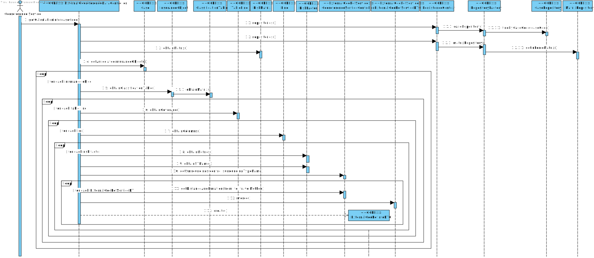

#Aluno 1171173 - SG07
##1. Requisitos
**SG07** - Como SG pretendo disponibilizar de forma integrada/consolidada toda a informação georreferenciada necessária ao cálculo do índice de risco de um determinado Pedido de Avaliação de Risco.

+ **SG07.1.** A transformação dos valores numéricos (e.g. distância, tempo, quantidade) fornecidos pelos serviços externos para a escala discreta da matriz de risco (“baixa”, “média”, “alta”) é realizada através de um par de valores (A e B) pré-definidos (configurados) por tipo de envolvente. Exemplo: um valor numérico inferior a A implica classificar como “baixa”, por outro lado se o valor for superior a B implica classificar como “alta”, caso contrário classifica- se como “média”.

+ **SG07.2.** A transformação anterior é realizada através de uma expressão especificada de acordo com uma gramática a desenvolver. A gramática deve permitir expressar regras semelhantes às aplicadas anteriormente (i.e. baseadas em 2 valores).

+ **SG07.3.** Evoluir a gramática para permitir expressar regras mais complexas (e.g. explorar informação de contexto) e para uma escala com mais de 3 valores discretos.

    
##2. Análise
+ Apesar deste caso de uso dizer respeito ao serviço externo de georreferenciação, este trata de regras de negócio que fazem sentido estarem implementadas no CORE. Para isso foi criado um controller no CORE para gerir o caso de uso.
+ Desta maneira evita-se dependências do EXTERNAL GEOREFERENCE SERVICE para o CORE.

##3. Design

###3.1. Realização da Funcionalidade
####SD SE05

###3.2. Diagrama de Classes
+ **CORE:**
	+ ExternalGeoRefDataController
	+ Case
	+ InsuranceObject
	+ ExternalGeoRefInfoDTO
	+ ClassificationTable
	+ TableLine
	+ Line
	+ RiskMatrix
	+ RiskFactor
	+ PersistenceContext
	+ RepositoryFactory
	+ CaseRepository
	+ MatrixRepository
	+ EvalListener
	+ Grammar
	+ GrammarBaseListener
	+ GrammarListener
	+ GrammarLexer
	+ GrammarParser

+ **EXTERNAL GEO REF SERVICE:**
	+ ExternalGeoRefServiceDTO
	+ ExternalGeoRefServiceController

###3.3. Padrões Aplicados
+ Data Transfer Object
+ Repository Factory

###3.4. Testes
+ Verificar se enviando um caso são retornados os valores corretos

##4. Implementação
Foi criada uma gramática com uso da biblioteca **antlr4** para gerar automáticamente as classes da mesma.

##5. Integration/Demonstration
Este UC foi implementado no módulo CORE fazendo uso do serviço de georreferenciação

##6. Observações
+ Para facilitar a busca de informação, para qualquer que seja a cobertura pedida no caso, é pesquisada toda a informação (distância, duração, quantidade).
+ Os valores considerados baixo, médio ou alto foram decididos entre equipa, visto que nada é dito nos requisitos sobre quais estes valores.