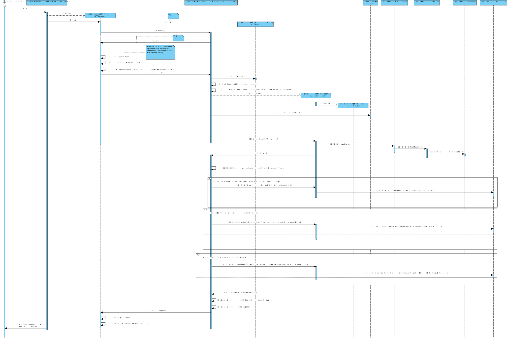
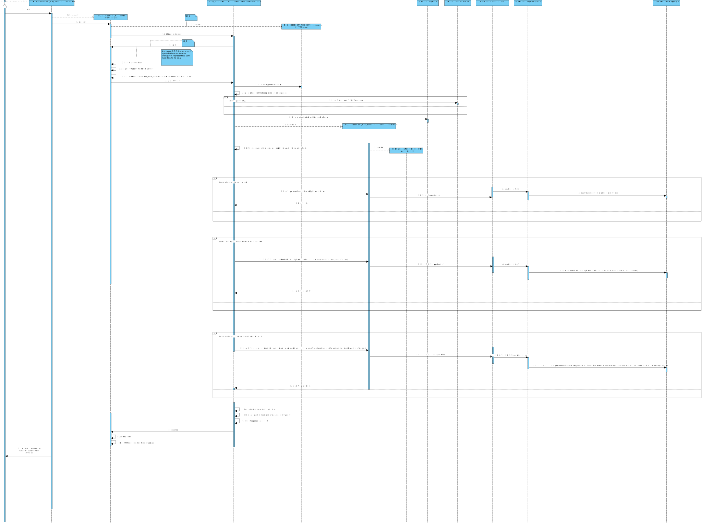

** [1171409](../)** - SE03
=======================================

# 1. Requisitos

+ SE03. Como SE pretendo obter o resultado dos Pedidos de Avaliação de Risco já concluídos que satisfazem um determinado conjunto de critérios de filtragem.

        SE03.1. Suportar filtro para um determinado período de tempo. (nível mínimo)
        SE03.2. Suportar filtro para pedidos relativos a locais pertencentes a uma ou mais cidades.
        SE03.3. Suportar a combinação dos filtros anteriores. (nivel máximo)

A interpretação feita deste requisito foi no sentido de ,dado um determinado intervalo de tempo(data inicial e data final),dado um ou mais cidade ou mesmo a combinação dos dois, obter o resultado dos pedidos de avaliação já concluidos .

Um sistema externo, submete um pedido de avaliação através de um pedido de HTTP (ou, futuramente HTTPS). 

O pedido irá conter:
* um identificador do sistema (token, previamente gerado)
* o tipo de ficheiro que quer receber (XML/JSON/XHTML)
* informação sobre quai o intervalo de tempo ou sobre as cidades ou a junção dos dois a fim de obter os resultados dos pedidos já concluidos, em formato XML ou JSON

O webserver, posteriormente, irá interpretar e validar os dados recebidos e, caso válidos, reencaminhar o pedido para os módulos competentes. Após obter o resultado, este é retornado para o Sistema externo, através da conexão previamente estabelecida, em formato XML, JSON ou XHTML.

=====================================================================

# 2. Análise

*Neste secção o estudante deve relatar o estudo/análise/comparação que fez com o intuito de tomar as melhores opções de design para a funcionalidade bem como aplicar diagramas/artefactos de análise adequados.*

+ Este caso de uso será implementado no módulo RISK ASSESSEMENT WEBSERVER uma vez que o ator deste US é o sisterma externo. No entanto o módulo irá recorrer ao módulo RISK APP, que fará a análise necessária.
+ Todos os pedidos tem de estar concluidos  para a realização do Caso de Uso.
+  o método HTTP usado será Post
+ conversão do pedido para xml e uma validação atraves de um xsd
+ Será necesario obter operar sobre pedidos de avaiação já concluidos
+ Neste caso de uso o request é convertido para xml caso nao o seja, para assim passar por validações
+ No final é convertido para o formato recebido no request.

=====================================================================

# 3. Design

+ Para este caso de uso necessitamos de:

            +criterios de filtragem: periodo de tempo, uma ou mais cidades , ou a combinação dos dois 
            + Precisamos de verificar se os pedidos estão ou nao concluidos
            + validações do conteudo do request 
            + Caso o request seja xml necessitamos de um xsd que o valide
            + Se o request nao for xml, convertemos para xml e validados através de um xsd
            + obter os casos para os parametros enviados: duas datas, lista de cidades ou ambos.
            + obter o resultado de casa caso e contruir a informação necessária para ser apresentada
            + exportar o restultado do request para o formato pedido

## 3.1. Realização da Funcionalidade

*Nesta secção deve apresentar e descrever o fluxo/sequência que permite realizar a funcionalidade.*

## 3.2. Diagrama de Classes

## 3.3. Padrões Aplicados

+Builder
+Factory
+Repository
+State

## 3.4. Testes 
 
 + Para este UC foram feitos os seguintes testes : 
 
 **Teste 1:** Verificar que o Servidor pode estar disponível ou não:

    @Test
    public void testHandle(){
    System.out.println("handle");
    HTTPmessage request = new HTTPmessage();
    request.setURI("riskAssessment/cases/obtain?export=xml");
    request.setRequestMethod("POST");
    request.setHeader("Authorization", "kuibjkhsabewfhjkuifu73g38wshgfilu");
    request.setContentFromFile("input.xml");
    ConcludedCasesRequestHandler instance = new ConcludedCasesRequestHandler();
    HTTPmessage expResult = new HTTPmessage();
    expResult.setResponseStatus(Config.POSITIVE_RESPONSE);
    expResult.setContentFromFile("input.xml");
    HTTPmessage result = instance.handle(request);
    assertEquals(expResult.getStatus(), result.getStatus());
    }
    
 
  **Teste 2** Verificar que os casos completos estao a ser obtidos consante  os parametros enviaddos no request
 
    
     @Test
     public void testParseCompletedCases() throws Exception {
     System.out.println("parseCompletedCases");
     String content
     = "<requests>   "
     + "  <request>   "
     + "      <parametersFromRequest>   "
     + "          <matrixVersion>1</matrixVersion>    "
     + "             <state>Processado</state>            "
     + "             <initialDate></initialDate>           "
     + "             <finalDate></finalDate>              "
     + "              <cities>                 "
     + "                     <city>Porto</city>  "
     + "              </cities>       "
     + "       </parametersFromRequest> "
     + "    </request> "
     + "</requests>";
     DocumentBuilderFactory factory = DocumentBuilderFactory.newInstance();
     DocumentBuilder builder;
     
     builder = factory.newDocumentBuilder();
     Document doc = builder.parse(new InputSource(new StringReader(content)));
     java.io.Writer writer = new java.io.FileWriter("input.xml");
     XMLSerializer xml = new XMLSerializer(writer, null);
     xml.serialize(doc);
     
     Element keysElement = doc.getDocumentElement();
     if (!keysElement.getTagName().equals("request")) {
     keysElement = (Element) keysElement.getElementsByTagName("request").item(0);
     }
     
     NodeList iObjects = keysElement.getElementsByTagName("parametersFromRequest");
     String matrixVersion = "1";
     List<CaseI> expResult = new ArrayList<>();
     expResult.add(createCaseTest4());
     expResult.add(createCaseTest5());
     expResult.add(createCaseTest6());
     List<CaseI> result = ConcludedCasesRequestHandler.parseCompletedCases(iObjects, matrixVersion);
     assertEquals(expResult, result);
     }
 
 
 
  **Teste 2.1** Verificar que os casos completos estao a ser obtidos consante  os parametros enviaddos no request 

   
     @Test
     public void testCasesSatisfingRequest() throws Exception {
     System.out.println("casesSatisfingRequest");
     CaseState stateOfCase = CaseState.PROCESSED;
     CaseDate startDate = new CaseDate("");
     CaseDate finalDate = new CaseDate("");
     List<String> cities = new ArrayList<>();
     cities.add("Porto");
     List<CaseI> expResult = new ArrayList<>();
     expResult.add(createCaseTest4());
     expResult.add(createCaseTest5());
     expResult.add(createCaseTest6());
     List<CaseI> result = ConcludedCasesRequestHandler.casesSatisfingRequest(stateOfCase, startDate, finalDate, cities);
     assertEquals(expResult, result);
     }
     
     
   **Teste 3**Verificar que os casos completos estao a ser obtidos consante  as cidades  enviadas no request 
 
     
     @Test
     public void testGetCaseResultsFilteredByCities() {
     System.out.println("getCaseResultsFilteredByCities");
     List<String> cities = new ArrayList<>();
     cities.add("Porto");
     List<CaseI> allCasesByState = new ArrayList<>();
     allCasesByState.add(createCaseTest4());
     allCasesByState.add(createCaseTest5());
     allCasesByState.add(createCaseTest6());
     List<CaseI> expResult = new ArrayList<>();
     expResult.add(createCaseTest4());
     expResult.add(createCaseTest5());
     expResult.add(createCaseTest6());
     List<CaseI> result = ConcludedCasesRequestHandler.getCaseResultsFilteredByCities(cities, allCasesByState);
     assertEquals(expResult, result);
     }
     
     
**Teste 4**Verificar que os casos completos estao a ser obtidos consante  as datas enviadas no request 
     
     
     @Test
     public void testGetCaseResultsFilteredByDates() throws ParseException {
     System.out.println("getCaseResultsFilteredByCities");
     List<String> cities = new ArrayList<>();
     cities.add("Porto");
     List<CaseI> allCasesByState = new ArrayList<>();
     allCasesByState.add(createCaseTest4());
     allCasesByState.add(createCaseTest5());
     allCasesByState.add(createCaseTest6());
     List<CaseI> expResult = new ArrayList<>();
     expResult.add(createCaseTest4());
     expResult.add(createCaseTest5());
     expResult.add(createCaseTest6());
     List<CaseI> result = ConcludedCasesRequestHandler.getCaseResultsFilteredByTimeInterval(new CaseDate("06/06/2006"),new CaseDate("23/12/2020"),allCasesByState);
     assertEquals(expResult, result);
     }
     
     
**Teste 5**Verificar que os casos completos estao a ser obtidos consante  as datas e as cidades  enviadas no request      
     
    
     @Test
     public void testGetCaseResultsFilteredByDatesAndCities() throws ParseException {
     System.out.println("getCaseResultsFilteredByCitiesandDates");
     List<String> cities = new ArrayList<>();
     cities.add("Porto");
     List<CaseI> allCasesByState = new ArrayList<>();
     allCasesByState.add(createCaseTest4());
     allCasesByState.add(createCaseTest5());
     allCasesByState.add(createCaseTest6());
     List<CaseI> expResult = new ArrayList<>();
     expResult.add(createCaseTest4());
     expResult.add(createCaseTest5());
     expResult.add(createCaseTest6());
     List<CaseI> result = ConcludedCasesRequestHandler.getCaseResultsFilteredByTimeIntervalAndCities(new CaseDate("06/06/2006"),new CaseDate("23/12/2020"),cities,allCasesByState);
     assertEquals(expResult, result);
     }
     
     
     
     
**Teste 6**Verificar o case date é convertido corretamente para data 
     
    
     @Test
     public void testConvertStringToDate() throws Exception {
     System.out.println("convertStringToDate");
     CaseDate date = new CaseDate("06-Jun-2006");
     SimpleDateFormat formatter = new SimpleDateFormat("dd-MMM-yyyy", Locale.ENGLISH);
     Date expResult = formatter.parse(date.toString());
     Date result = ConcludedCasesRequestHandler.convertStringToDate(date);
     assertEquals(expResult, result);
     
     }
     
     
  **Teste 7*Verificar que a resposta é contruida corretamente
     
    
     @Test
     public void testBuildResponse() {
     System.out.println("buildResponse");
     File file = new File("SE03.xml");
     HTTPmessage expResponse = new HTTPmessage();
     expResponse.setContentFromFile(file.getName());
     expResponse.setResponseStatus(Config.POSITIVE_RESPONSE);
     HTTPmessage response = new HTTPmessage();
     ConcludedCasesRequestHandler instance = new ConcludedCasesRequestHandler();
     instance.buildResponse(response, file,Config.POSITIVE_RESPONSE);
     assertArrayEquals(expResponse.getContent(), response.getContent());
     assertEquals(expResponse.getStatus(), response.getStatus());
     }
 
 
 -
 
  **Teste 8** Verificar que a informação é exportada direita  
    

    @Test
    public void testExportIntoDesiredFileType() throws Exception {
    System.out.println("exportIntoDesiredFileType");
    String filetype = "XML";
    String content = "Case Information:\n"
    + "Identifier:Code4\n"
    + "State:State: Processado\n"
    + "Result\n"
    + "Carro-&gt; 76\n"
    + "Mota-&gt; 76\n"
    + "\n"
    + "Case Information:\n"
    + "Identifier:Code33\n"
    + "State:State: Processado\n"
    + "Result\n"
    + "Habitacao-&gt; 76\n"
    + "Roubos-&gt; 76\n"
    + "\n"
    + "Case Information:\n"
    + "Identifier:Code12\n"
    + "State:State: Processado\n"
    + "Result\n"
    + "Habitacao-&gt; 76\n"
    + "Roubos-&gt; 76";
    ConcludedCasesRequestHandler instance = new ConcludedCasesRequestHandler();
    instance.exportIntoDesiredFileType(filetype, content);
    assertEquals(new File("SE03_Test.xml").getFreeSpace(), new File("SE03.xml").getFreeSpace());
    filetype = "XHTML";
    instance.exportIntoDesiredFileType(filetype, content);
    assertEquals(new File("SE03_Test.xhtml").getFreeSpace(), new File("SE03.xhtml").getFreeSpace());
    filetype = "JSON";
    instance.exportIntoDesiredFileType(filetype, content);
    assertEquals(new File("SE03_Test.json").getFreeSpace(), new File("SE03.json").getFreeSpace());
    File f = instance.exportIntoDesiredFileType("TXT", content);
    assertNull(f);
    }

=====================================================================

# 4. Implementação

*Nesta secção o estudante deve providenciar, se necessário, algumas evidências de que a implementação está em conformidade com o design efetuado. Para além disso, deve mencionar/descrever a existência de outros ficheiros (e.g. de configuração) relevantes e destacar commits relevantes;*

+ Para este caso de uso enviamos um request através do postman  que será  recebido pelo nosso servidor. Caso este não seja xml, o mesmo é convertido para tal, para assim passar por valiações de input.
+ Apos ser validado obtemos uma nodelist com todos dados do request,  e com esses dados vamos obter o a lista de casos que obedecem aos criteiros de filtragem passados no request.

        public static List<CaseI> parseCompletedCases(NodeList iObjects, String matrixVersion) throws java.text.ParseException {

            String stateOfCase = "";
            String startDate = "";
            String finalDate = "";

            CaseDate inicialDate = null;
            CaseDate endDate = null;

            CaseState state = null;

            List<String> cities = new ArrayList<>();

            for (int i = 0; i < iObjects.getLength(); i++) {
                Element iObjectElement = (Element) iObjects.item(i);
                //state of the case
                matrixVersion = iObjectElement.getElementsByTagName("matrixVersion").item(0).getTextContent();
                //state of the case
                stateOfCase = iObjectElement.getElementsByTagName("state").item(0).getTextContent();
                if (stateOfCase.equalsIgnoreCase(CaseState.PROCESSED.toString())) {
                    state = CaseState.PROCESSED;
                }

                try {
                    //start date from the request
                    startDate = iObjectElement.getElementsByTagName("startDate").item(0).getTextContent();
                    inicialDate = new CaseDate(startDate);
                } catch (NullPointerException ex) {
                    ex.printStackTrace();
                    startDate = "";
                    inicialDate = new CaseDate(startDate);
                try {
                    // end date from the request
                    finalDate = iObjectElement.getElementsByTagName("finalDate").item(0).getTextContent();
                    endDate = new CaseDate(finalDate);
                    } catch (NullPointerException ex1) {
                        ex1.printStackTrace();
                        if (!inicialDate.toString().equals("")) {
                            endDate = CaseDate.tempVersion();
                        } else {
                            finalDate = "";
                            endDate = new CaseDate(finalDate);
                        }
                    }
                finalDate = "";
            }

        try {

        // add the cities to a list if they exist
        NodeList cityList = iObjectElement.getElementsByTagName("cities");

                for (int j = 0; j < cityList.getLength(); j++) {
                    Element cityElement = (Element) cityList.item(j);
                    cities.add(cityElement.getTextContent());
                }
            } catch (NullPointerException ex2) {
            ex2.printStackTrace();
            cities = new ArrayList<>();
            }
        }   
        return casesSatisfingRequest(state, inicialDate, endDate, cities);
        }

        
        public static List<CaseI> casesSatisfingRequest(CaseState stateOfCase, CaseDate startDate, CaseDate finalDate, List<String> cities) throws java.text.ParseException {
        List<CaseI> allCasesByState = concludedCasesController.getAllCasesByState(stateOfCase);

        if (startDate.toString().equals("") && finalDate.toString().equals("") && !cities.isEmpty()) {  
            return getCaseResultsFilteredByCities(cities, allCasesByState);
        } else if (cities.isEmpty() && !startDate.equals("") && !finalDate.equals("")) {
            return getCaseResultsFilteredByTimeInterval(startDate, finalDate, allCasesByState);
        } else if (!cities.isEmpty() && !startDate.equals("") && !finalDate.equals("")) {
            return getCaseResultsFilteredByTimeIntervalAndCities(startDate, finalDate, cities, allCasesByState);
        } else {
            return new ArrayList<>();
            }
        }

        public static List<CaseI> getCaseResultsFilteredByCities(List<String> cities, List<CaseI> allCasesByState) {
            List<CaseI> allCasesByCities = new ArrayList<>();
            for (String city : cities) {
                for (CaseI caseFromAllCasesByState : allCasesByState) {
                        List<InsuranceObject> insuranceAssociated = caseFromAllCasesByState.getAssociatedInsuranceObjects();
                        for (InsuranceObject io : insuranceAssociated) {
                                if (io.obtainDistrict().equalsIgnoreCase(city)) {
                                    allCasesByCities.add(caseFromAllCasesByState);
                                }
                            }
                }
            }
        return allCasesByCities;
        }

        
        private static List<CaseI> getCaseResultsFilteredByTimeInterval(CaseDate startDate, CaseDate finalDate, List<CaseI> allCasesByState) throws java.text.ParseException {
                List<CaseI> allCasesByDate = new ArrayList<>();
                Date in = convertStringToDate(startDate);
                Date fin = convertStringToDate(finalDate);
                for (CaseI caseFromAllCasesByState : allCasesByState) {
                        Date date = convertStringToDate(new CaseDate(caseFromAllCasesByState.obtainDate()));
                        if (date.after(in) && date.before(fin)) {
                            allCasesByDate.add(caseFromAllCasesByState);
                        }
                }
                return allCasesByDate;
            }

        protected static Date convertStringToDate(CaseDate date) throws java.text.ParseException {
            // formato data 06/06/2006 dia-mes-ano  
            SimpleDateFormat f = new SimpleDateFormat("dd-MM-yyyy");
            return f.parse(date.toString());
        }

        private static List<CaseI> getCaseResultsFilteredByTimeIntervalAndCities(CaseDate startDate, CaseDate finalDate, List<String> cities, List<CaseI> allCasesByState) throws java.text.ParseException {
            
            List<CaseI> allCasesByCitiesAndDate = new ArrayList<>();
            Date in = convertStringToDate(startDate);
            Date fin = convertStringToDate(finalDate);
            for (String city : cities) {
                    for (CaseI caseFromAllCasesByState : allCasesByState) {
                            Date date = convertStringToDate(new CaseDate(caseFromAllCasesByState.obtainDate()));
                            List<InsuranceObject> insuranceAssociated = caseFromAllCasesByState.getAssociatedInsuranceObjects();
                            for (InsuranceObject io : insuranceAssociated) {
                                    if (date.after(in) && date.before(fin)) {
                                        if (io.obtainDistrict().equalsIgnoreCase(city)) {
                                            allCasesByCitiesAndDate.add(caseFromAllCasesByState);
                                        }
                                    }
                                }
                    }
            }
            return allCasesByCitiesAndDate;
            }

+ Após a obtenção da Lista de casos consoante os criterios de filtragem, vamos formar uma string que ira conter a informação do caso entre elas o resultado final:

            private String buildCasesInformationToString(List<CaseI> cases, String matrixVersion) {
                StringBuilder infoFromCases = new StringBuilder();
                infoFromCases.append("Cases:");
                for (CaseI concludedCase : cases) {
                        String result = assessmentResultController.getIntegerRiskIndex(concludedCase.obtainCode(), matrixVersion);
                        infoFromCases.append("\n");
                        infoFromCases.append("Case Information:");
                        infoFromCases.append("Identifier:");
                        infoFromCases.append(concludedCase.obtainCode());
                        infoFromCases.append("\n");
                        infoFromCases.append("State:");
                        infoFromCases.append(concludedCase.obtainState());
                        infoFromCases.append("\n");
                        infoFromCases.append("Result");
                        infoFromCases.append(result);
                }
                return infoFromCases.toString();
            }

+ Por fim esta string é convertida no formato que vem no URI do request,

            protected File exportIntoDesiredFileType(String filetype, String content) throws IOException {
                    ExportUtil ex = new ExportUtil();
                    switch (filetype) {
                    
                            case "XML":
                                        File exported = ex.transformIntoXML(content, XML_FILE_NAME, FUNC, "Result");
                                        if (ex.validateXML(exported, XSD_FILE_NAME)) {
                                            return exported;
                                        } else {
                                            return null;
                                        }
                          
                          case "JSON":
                                        ex.exportToJSon(content, XML_FILE_NAME, JSON_FILE_NAME, FUNC, "Result");
                                        return new File(JSON_FILE_NAME);
                          
                          case "XHTML":
                                        ex.exportToXHTML(content, XML_FILE_NAME, XSD_FILE_NAME, XHTML_FILE_NAME, XSL_FILE_NAME, FUNC, "Result");
                                        return new File(XHTML_FILE_NAME);
                         default:
                                        return null;
                }
        }

+ Ficheiros utilizados:

**XSD PARA VALIDAR O INPUT DO REQUEST:**

    <?xml version="1.0" encoding="UTF-8"?>
    <xs:schema xmlns:xs="http://www.w3.org/2001/XMLSchema">
    <xs:element name="requests" type="requestsType"/>
    <!-- requestsType type -->
    <xs:complexType name="requestsType">
    <xs:sequence>
    <xs:element name="request" type="requestType" maxOccurs="unbounded"/>
    </xs:sequence>
    </xs:complexType>
    <!-- requestType type -->
    <xs:complexType name="requestType">
    <xs:sequence>
    <xs:element name="parametersFromRequest" type="parametersFromRequestType"/>
    </xs:sequence>
    </xs:complexType>
    <!-- parametersFromRequestType type -->
    <xs:complexType name="parametersFromRequestType">
    <xs:sequence>
    <xs:element name="matrixVersion" type="xs:string"/>
    <xs:element name="state" type="xs:string"/>
    <xs:element name="initialDate" type="dataType"/>
    <xs:element name="finalDate" type="dataType"/>
    <xs:element name="cities" type="citiesType"/>
    </xs:sequence>
    </xs:complexType>
    <!-- dataType type -->
    <xs:simpleType name="dataType">
    <xs:restriction base="xs:string">
    <xs:minLength value="0"/>
    </xs:restriction>
    </xs:simpleType>
    <!-- CitiesType type -->
    <xs:complexType name="citiesType">
    <xs:sequence maxOccurs="unbounded">
    <xs:element name="city" type="xs:string"/>
    </xs:sequence>
    </xs:complexType>
    </xs:schema>

**XSD PARA VALIDAR O OUTPUT DO REQUEST:**

    <?xml version="1.0" encoding="UTF-8"?>
    <xs:schema
    xmlns:xs="http://www.w3.org/2001/XMLSchema">
    <xs:element name="SE03" type="SE03Type"/>

    <!-- SE03 type -->
    <xs:complexType name="SE03Type">
    <xs:sequence>
    <xs:element name="Result" type="xs:string"/>
    </xs:sequence>
    </xs:complexType>

    </xs:schema>

**XSL PARA AS TRANSFORMAÇÕES  DO REQUEST:**

    <!--<?xml version="1.0" encoding="UTF-8"?>-->
    <xsl:stylesheet xmlns:xsl="http://www.w3.org/1999/XSL/Transform" version="1.0">
    <xsl:output method="xml"/>
    <!-- template SE03 -->
    <xsl:template match="/SE03">
    <html>
    <head>
    <title>Resultado Obtido nos Casos Classificados como Concluidos.</title>
    </head>
    <body>
    Result: <xsl:value-of select="Result"/>
    </body>
    </html>
    </xsl:template>
    </xsl:stylesheet>

=====================================================================

# 5. Integration/Demonstration

*Nesta secção o estudante deve descrever os esforços realizados no sentido de integrar a funcionalidade desenvolvida com as restantes funcionalidades do sistema.*

+ Para esta UC a maior dificuldade foi perceber como funcionava o handle e a interção com o postman.
+ foi necessario criar xds que valida o xml vindo do request, um xds para validar o xml resultante e um xsl para as transformações necessárias 
+ criar queries necessárias para a obtencção dos casos dados os criterios de filtragem 
+ Para integrar com as restantes funcionalidades do sistema foi necessário as devidas dependências e cuidado a seguir os padrões das restantes funcionalidades.

=====================================================================

# 6. Observações

*Nesta secção sugere-se que o estudante apresente uma perspetiva critica sobre o trabalho desenvolvido apontando, por exemplo, outras alternativas e ou trabalhos futuros relacionados.*

+ Utilização do padrão Strategy no RequestHandlers e seus derivados para cada funcionalidade do Sistema Externo.
+ Em discussão com elementos de outro grupo, foi apresentada a ideia de ter uma classe com um mapa(SwitchMap) que para cada par (Method,URI) tinha uma classe correspondente que implementaria uma interface com um método de interpretação do pedido recebido. Apesar de na altura parecer uma ideia que acrescentaria classes desnecessárias ao projeto, a modularidade do projeto e legibilidade do código benificiam bastante desta implementação, pelo que a usaremos.
+ Utilização de ferramentas adequadas para transformações, validações e passagens de tipos de ficheiro para outros tipos de ficheiro.

+ Esta UC seria implementada  de forma correta se obedece-se ao seguinte diagrama de sequência,o que nao aconteceu, como foi posssivel verificar no diagrama visto anteriormente:

+ Todavia,como cada caso poderia ter mais do que um insurance object associado, nao havia como conseguir implementar as queries de maneira correta, porem as mesma estão feitas como pedido mas,infelizmente, para o nosso dominio, não funcionam :
+ Como prova aqui está a construção das mesmas :

        @Override
        public List<CaseI> getCaseResultsFilteredByTimeInterval(CaseState caseState, CaseDate startDate, CaseDate finalDate) {
            Map<String, Object> param = new HashMap<>();
            param.put("caseState", caseState);
            param.put("initialDate", startDate);
            param.put("finalDate", finalDate);
            List<CaseI> ret = super.match("e.caseState = :caseState AND e.caseDate >=initialDate AND e.caseDate <= finalDate ", param);

            if (!ret.isEmpty()) {
                return ret;
            }
            return new ArrayList<>();
        }

        @Override
        public List<CaseI> getCaseResultsFilteredByCities(CaseState caseState, List<String> districts) {    
            Map<String, Object> param = new HashMap<>();
            param.put("caseState", caseState);
            List<CaseI> ret = new ArrayList<>();
            List<CaseI> cases = new ArrayList<>();
            for (String district : districts) {
                param.put("city" + districts.indexOf(district), district);
                ret = super.match("e.caseState = :caseState AND e.INSURANCEOBJECT.location.district = : city", param);
                if (!ret.isEmpty()) {
                    cases.addAll(ret);
                }
            }
            if (!cases.isEmpty()) {
                return cases;
            }
            return new ArrayList<>();
        }

        @Override
        public List<CaseI> getCaseResultsFilteredByTimeIntervalAndCities(CaseState caseState, CaseDate startDate, CaseDate finalDate, List<String> districts) {
            Map<String, Object> param = new HashMap<>();
            param.put("caseState", caseState);
            param.put("initialDate", startDate);
            param.put("finalDate", finalDate);
            List<CaseI> ret = new ArrayList<>();
            List<CaseI> cases = new ArrayList<>();
            for (String district : districts) {
                param.put("city" + districts.indexOf(district), district);
                ret = super.match("e.caseState = :caseState AND e.caseDate >=initialDate AND e.caseDate <= finalDate e.INSURANCEOBJECT.location.district = : city", param);
                
                if (!ret.isEmpty()) {
                    cases.addAll(ret);
                }
            }
            if (!cases.isEmpty()) {
                return cases;
            }
            return new ArrayList<>();
        }

