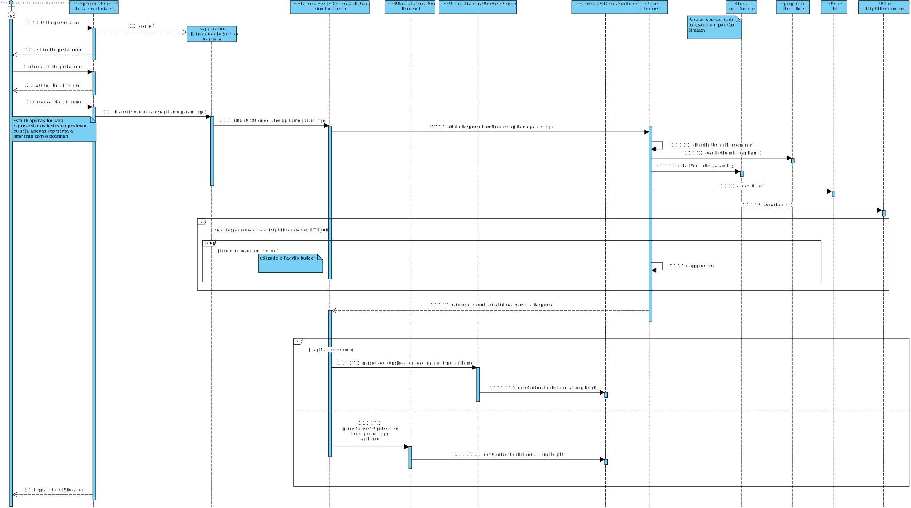
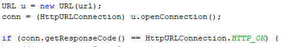
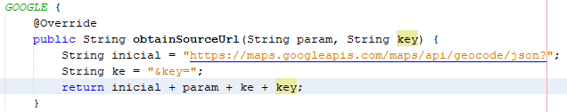

** [1171409](../)** - SG01
=======================================

# 1. Requisitos

SG01. Como SG pretendo obter a localização GPS de um determinado local a partir do seu endereço postal.

• SG01.1. Esta informação deve ser obtida usando o serviço externo Microsoft Bing Services (MBS).
• SG01.2. Esta informação deve ser obtida usando o serviço externo Google Maps Services (GMS).
• SG01.3. O sistema deve usar o serviço que estiver configurado para o efeito.

A interpretação feita deste requisito foi no sentido de ,dado um codigo postal, indicar as cordenadas do local,utilizando ,para isso, o MBS ou GMS.

=====================================================================

# 2. Análise

*Neste secção o estudante deve relatar o estudo/análise/comparação que fez com o intuito de tomar as melhores opções de design para a funcionalidade bem como aplicar diagramas/artefactos de análise adequados.*

• Este caso de uso terá de ser implementado no módulo EXTERNAL GEOREFERENCE SERIVCE pois trata-se de uma user story do Serviço Georreferenciação . No entanto, vai interagir com o módulo CORE pois requer regras de negócio que estão neste implementadas.
• O objetivo deste caso de uso é indicar a localização GPS de um dado local, dado o código-postal do mesmo. A obtenção da localização será suportada pelo uso de duas APIs (MBS e GMS), onde o Serviço de GeoReferência dará a escolha as duas APIs, para a operação se realizar. 
• Para esta operação será recebido como input um identificador da API escolhida e também um codigo-postal.
• Dado isto, necessitamos de um http request realizado pelo URL para ser estabelecida a ligação com a API selecionada anteriormente.
• O codigo postal inidcado anteriormente será  enviado para a api com o http request  o retorno será as coordenadas do local.

=====================================================================

# 3. Design

+ Necessitamos de um http request realizado pelo Url para ser estabelecida a ligação com a API fornecida.

+ Uma query com parametros para a API receber o endereço postal.
+ Realizada uma coneção para "pedir" um ficheiro json com os dados para um certo endereço postal.

## 3.1. Realização da Funcionalidade

*Nesta secção deve apresentar e descrever o fluxo/sequência que permite realizar a funcionalidade.*

## 3.2. Diagrama de Classes

## 3.3. Padrões Aplicados

+ Strategy (aplicado no tratamento do url para o GMS e MBS);
+ Builder(aplicado para contruir o JsonObject ,e para a Location);
+ DTO

## 3.4. Testes 
**Teste 1.0:** Verificar que é possivel criar uma chave conforme a sua source valida.

    @Test
    public void constructorValide() {
    k = new Key("4545-4545-4545-4545", "google");
    }

**Teste 1.1:** Verificar que não é possivel criar uma chave 12 numeros

    @Test(expected = IllegalArgumentException.class)
    public void constructorInvalide3Times() {
    k = new Key("4545-4545-4545", "google");
    }

**Teste 2:** A utlização do postman

**Teste 3:** Testar a obtençcao das coordenadas GPS atraves das Apis do google (geoCode api e elevations api) e da Microsoft (GMS e MBS)

*Teste 3.1:* Google Maps Service 
    
    /**
    * Test of obtainGPSCoordenates method for google api , of class ExternalGeoRefService.
    */
    @Test
    public void testObtainGPSCoordenatesGoogle() throws Exception {
    System.out.println("obtainGPSCoordenatesGoogle");
    String apiName = "google";
    String param = "address=1600+Amphitheatre+Parkway,+Mountain+View,+CA";
    String type = "geocode";
    ExternalGeoRefService instance = new ExternalGeoRefService();
    GPSLocation expResult = new GPSLocation(37.4225182F, -122.0859944F, 5.911F);
    GPSLocation result = instance.obtainGPSCoordenates(apiName, param, type);
    assertEquals(expResult.getLatitude(), result.getLatitude(), 0.01F);
    assertEquals(expResult.getLongitude(), result.getLongitude(), 0.01F);
    assertEquals(expResult.getAltitude(), result.getAltitude(), 0.01F);
    }

*Teste 3.3:* Microsoft Bing Service 

    /**
    *Test of obtainGPSCoordenates method for microsoft api, of class ExternalGeoRefService.
    * @throws java.lang.Exception
    */
    @Test
    public void testObtainGPSCoordenatesMicrososft() throws Exception {
    System.out.println("obtainGPSCoordenatesMicrosoft");
    String apiName = "microsoft";
    String param = "q=1600%20Amphitheatre%20Parkway,%20Mountain%20View,%20CA";
    String type = "geocode";
    ExternalGeoRefService instance = new ExternalGeoRefService();
    GPSLocation expResult = new GPSLocation(37.4225182F, -122.0859944F, 5.911F);
    GPSLocation result = instance.obtainGPSCoordenates(apiName, param, type);
    assertEquals(expResult.getLatitude(), result.getLatitude(), 0.01F);
    assertEquals(expResult.getLongitude(), result.getLongitude(), 0.01F);
    

}
    
    
**Teste 4:** Request para a ligação as apis 

Teste 4.1:* validacao do parametro recebido pelas apis 

    /**
    * Test of addSep method, of class Param.
    */
    @Test
    public void testAddSepGoogle() {
    System.out.println("addSep");
    String var = "var var2";
    String api = "google";
    String expResult = "+var+var2";
    String result = Param.addSep(var, api);
    assertEquals(expResult, result);
    }

    @Test
    public void testAddSepMicrosoft() {
    System.out.println("addSep");
    String var = "var var2";
    String api = "microsoft";
    String expResult = "%20var%20var2";
    String result = Param.addSep(var, api);
    assertEquals(expResult, result);
}

=====================================================================

# 4. Implementação

*Nesta secção o estudante deve providenciar, se necessário, algumas evidências de que a implementação está em conformidade com o design efetuado. Para além disso, deve mencionar/descrever a existência de outros ficheiros (e.g. de configuração) relevantes e destacar commits relevantes;*

+ Apenas faria sentido obter dados da API caso o URL e HTTP forem validos.
+ O sistema só continua o metodo caso o Url seja valido.

+ Keys das apis  encontram-se nas keys.properties
+ A obtenção do Url (por exemplo da google) é composta pelo Url inicial onde no fim é colocado o tipo de ficheiro pretendido, neste caso json.
+ Os parametros para cada metodo são adicionados.
+ A key obtida noutro metodo tambem é adicionado ao Url completando assim um url valido.

+ toda a Implementação foi feita com a maior eficiencia e modularidade possivel e  de acordo com o design efetuado,obedecendo  às regras de negocio e adotando o uso de padroe:builder e stratagy

=====================================================================

# 5. Integration/Demonstration

*Nesta secção o estudante deve descrever os esforços realizados no sentido de integrar a funcionalidade desenvolvida com as restantes funcionalidades do sistema.*

+ para esta UC tive de percer como funcionavam as apis, parametros que recebia e o seu retorno, bem como a conexão as mesmas 

=====================================================================

# 6. Observações

*Nesta secção sugere-se que o estudante apresente uma perspetiva critica sobre o trabalho desenvolvido apontando, por exemplo, outras alternativas e ou trabalhos futuros relacionados.*

+ ponto a melhorar: utilização do padrão adapter neste conjunto de casos de uso pertencentes ao Serviço de GeoReferencia.
+caso de Uso implementado com o maximo de efificiência e modularidade possivel, o que levou a alguns refactors ao modulo 

