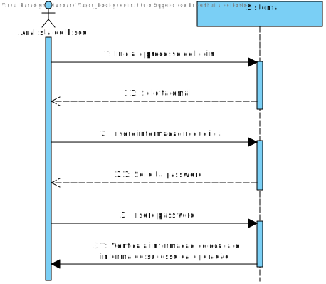
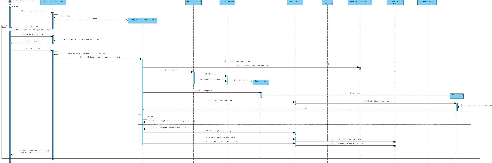
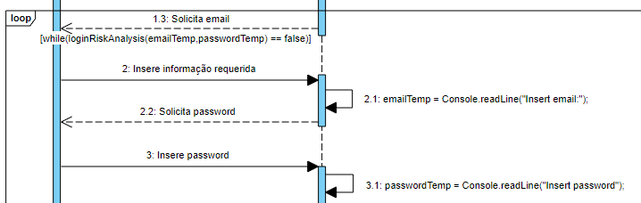
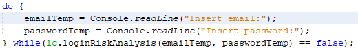
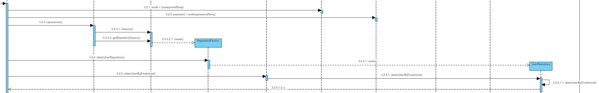
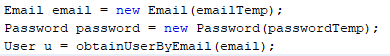
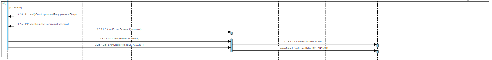
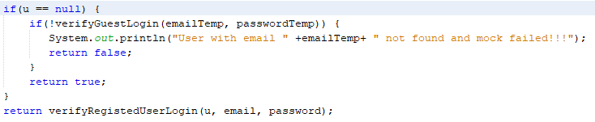
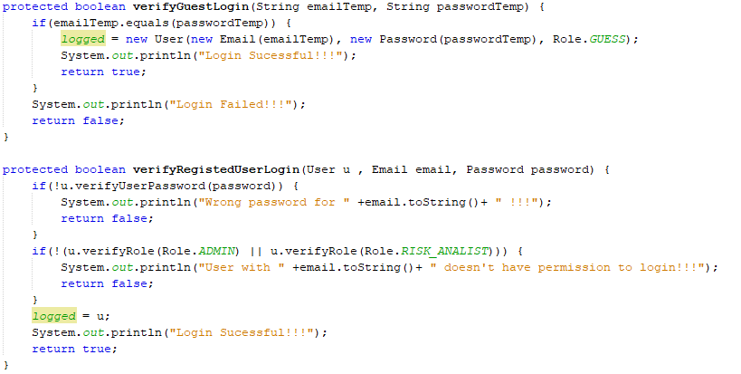

**Vasco Rodrigues [1171419](../)** - AR01.
=======================================

# 1. Requisitos

*Nesta secção o estudante deve indicar a funcionalidade desenvolvida bem como descrever a sua interpretação sobre a mesma e sua correlação e/ou dependência de/com outros requisitos.*

**AR01.** Como AR pretendo autenticar-me na aplicação para que possa realizar as minhas tarefas.

* AR01.1. Usar um mecanismo de autenticação simulado (mock) em que o utilizador e respetiva palavra-passe são iguais e correspondem a um endereço de email.
* AR01.2. Usar um mecanismo de autenticação em que a informação dos utilizadores está convenientemente persistida numa base de dados.

A interpretação feita deste requisito foi no sentido de implementar um sistema de login neste módulo do projeto para que apenas Utilizadores autorizados(Analistas de Risco) possam operar as funcionalidades que irão ser disponibilizadas posteriormente. Os Utilizadores referidos serão colocados no Sistema e na Base de Dados por um Bootstrap de Utilizadores, sendo que não é requerido, será implementado para testar/demonstrar esta funcionalidade.

# 2. Análise

*Neste secção o estudante deve relatar o estudo/análise/comparação que fez com o intuito de tomar as melhores opções de design para a funcionalidade bem como aplicar diagramas/artefactos de análise adequados.*

*Recomenda-se que organize este conteúdo por subsecções.*

## 2.1. Análise do Requesito

* Realizar login é obter acesso às funcionalidades deste módulo(AR).

* Este caso de uso terá de ser implementado no módulo RISK ANALYSIS pois trata-se de uma user story do Analista de Risco. No entanto, vai interagir com o módulo CORE pois requer regras de negócio que estão neste implementadas.

## 2.2. Regras de Negócio

* Um utilizador é reconhecidos pelo seu email, sendo que este tem que ser único.
* Um utilizador tem sempre apenas uma Password associada à sua conta de Utilizador
* Um utilizador poderá ter vários Tipos de Utilizador associados(e.g. Analista de Risco,Administrador) mas obrigatóriamente tem sempre um tipo.
* Apenas um Utilizador com o Tipo de Utilizador: Analista de Risco poderá fazer Login com sucesso neste módulo.

## 2.3. Atores

* Sistema
* Analista de Risco

# 3. Design

*Nesta secção o estudante deve descrever o design adotado para satisfazer a funcionalidade. Entre outros, o estudante deve apresentar diagrama(s) de realização da funcionalidade, diagrama(s) de classes, identificação de padrões aplicados e quais foram os principais testes especificados para validar a funcionalidade.*

*Para além das secções sugeridas, podem ser incluídas outras.*

## 3.1. Realização da Funcionalidade

*Nesta secção deve apresentar e descrever o fluxo/sequência que permite realizar a funcionalidade.*

## 3.2. Diagrama de Classes

*Nesta secção deve apresentar e descrever as principais classes envolvidas na realização da funcionalidade.*

+ **RISK ANALYSIS:**
	* UI: LoginUI,LoginAction
	* Controlador: LoginController
+ **CORE:**
	* PersistenceContext
	* Repositório: RepositoryFactory,UserRepository
	* Classe do Domínio: User,Role,RoleList,Password,Email
+ **CONFIG APP:**
	* UserBootstrap
	* Controlador: UserController

## 3.3. Padrões/Principios Aplicados

*Nesta secção deve apresentar e explicar quais e como foram os padrões de design aplicados e as melhores práticas*

* Repository
* Factory
* GRASP
* SOLID
* Strategy
* "Tell don't ask"

## 3.4. Testes
*Nesta secção deve sistematizar como os testes foram concebidos para permitir uma correta aferição da satisfação dos requisitos.*

**Teste 1:** Verificar que não é possível criar uma instância da classe User com valores nulos.

**Teste 2:** Verificar que não é possível criar uma instância da classe User com email vazio

**Teste 3:** Verificar que não é possível criar uma instância da classe User com email na forma incorreta

**Teste 4:** Verificar que não é possível criar uma instância da classe classe User com password vazia

**Teste 5:** Verificar que é possível ter acesso à aplicação por um mock de login onde email e password são iguais e são o email

**Teste 6:** Verificar que não é possível ter acesso à aplicação por um mock de login onde email e password são iguais e não são um email

**Teste 7:** Verificar que não é possível ter acesso à aplicação por um mock de login onde email e password são iguais e são o email mas em formato incorreto

**Teste 8:** Verificar que não é possível ter acesso à aplicação por um login onde email e password são iguais e são o email mas em formato incorreto

**Teste 9:** Verificar que não é possível ter acesso à aplicação com um email não registado na Base de Dados/Sistema

**Teste 10:** Verificar que não é possível ter acesso à aplicação com um email registado na Base de Dados/Sistema mas password que não coincida com a registada

**Teste 11:** Verificar que não é possível ter acesso à aplicação com um email registado na Base de Dados/Sistema e password que coincida com a registada mas sem o Título de Tipo de Utilizador: Analista de Risco ou Administrador

**Teste 12:** Verificar que é possível ter acesso à aplicação com um email registado na Base de Dados/Sistema e password que coincida com a registada com o Título de Tipo de Utilizador: Administrador

**Teste 13:** Verificar que é possível ter acesso à aplicação com um email registado na Base de Dados/Sistema e password que coincida com a registada com o Título de Tipo de Utilizador: Analista de Risco

**Teste 14:** Verificar que não é possível ter acesso à aplicação por um mock de login onde email e password são diferentes mas estão no formato correto

**Teste 15:** Verificar que não é possível ter acesso à aplicação por um mock de login onde email e password são iguais e não são um email

**Teste 16:** Verificar que não é possível ter acesso à aplicação por um mock de login onde email e password são iguais, não são um email e email no formato errado

**Teste 17:** Verificar que não é possível ter acesso à aplicação por um mock de login onde email no formato correto e password vazia

**Teste 18:** Verificar que não é possível ter acesso à aplicação por um mock de login onde pasword correta e email vazio

(Estes testes 5-18 encontram se feitos no LoginControllerTest com as respetivas correlações a este ficheiro no comentário da linha (e.g "assertTrue(instance.loginRiskAnalysis("admin1@gmail.com", "admin1")); //12" referindo se ao Teste 12))

# 4. Implementação

*Nesta secção o estudante deve providenciar, se necessário, algumas evidências de que a implementação está em conformidade com o design efetuado. Para além disso, deve mencionar/descrever a existência de outros ficheiros (e.g. de configuração) relevantes e destacar commits relevantes;*

*Recomenda-se que organize este conteúdo por subsecções.*

## 4.1. Evidenciar loop de login no Design

## 4.2. Evidenciar obtenção de utilizador para reconhecimento de login mocked ou não

## 4.1. Evidenciar login mocked ou não com base em 4.2

# 5. Integration/Demonstration

*Nesta secção o estudante deve descrever os esforços realizados no sentido de integrar a funcionalidade desenvolvida com as restantes funcionalidades do sistema.*

* Como o Login é a primeira ação que se pode ser feita no módulo AR, todas as funcionalidades desenvolvidas presentemente e futuramente estarão dependentes e integradas no Login, mas propriamente na sucesso do login de um utilizador.
* Mesmo assim, numa tentativa de integração desta funcionalidade nas outras, o menu deste módulo possibilita um logout da aplicação.

# 6. Observações

*Nesta secção sugere-se que o estudante apresente uma perspetiva critica sobre o trabalho desenvolvido apontando, por exemplo, outras alternativas e ou trabalhos futuros relacionados.*

* Visto que um Utilizador apenas terá email, password e Tipo(s) de Utilizador, não achei necessário implementar um DTO visto que toda a informação de um Utilizador é necessária para a concretização deste requesito.
* A implementação do AR01.2 não impossibilita que o login possa ser feito pelo mock referenciado em AR01.1
* Quando colocado email e password iguais no Login, este entra como Convidado, não verificando se este tem o Role de Analista de Risco e não se encontrando nem verificando se encontra na base de dados por questões de segurança.
* A escrita da password não é encriptada/escondida como normalmente é feito devia à falta de tal funcionalidade na Framework desenvolvida em EAPLI e conflito com Java na utilização da Classe Java.io.Console(ReadPassword()).
* Poderia ter utilizado a Classe Session desenvolvida na Framework mas não há nenhum requisito que pretenda saber quem é o User que fez login e o login só é feito neste módulo, achei que não seria necessário tal grau de complexidade.

