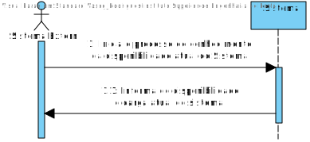
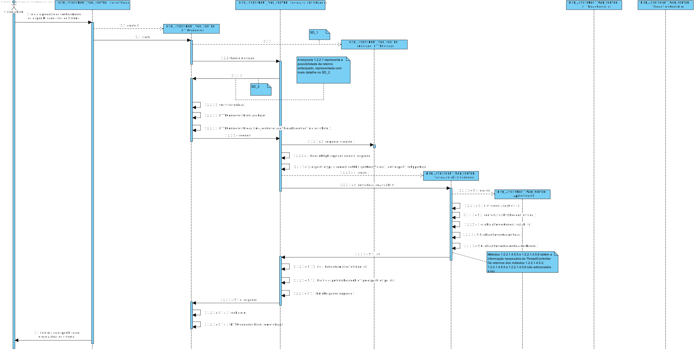
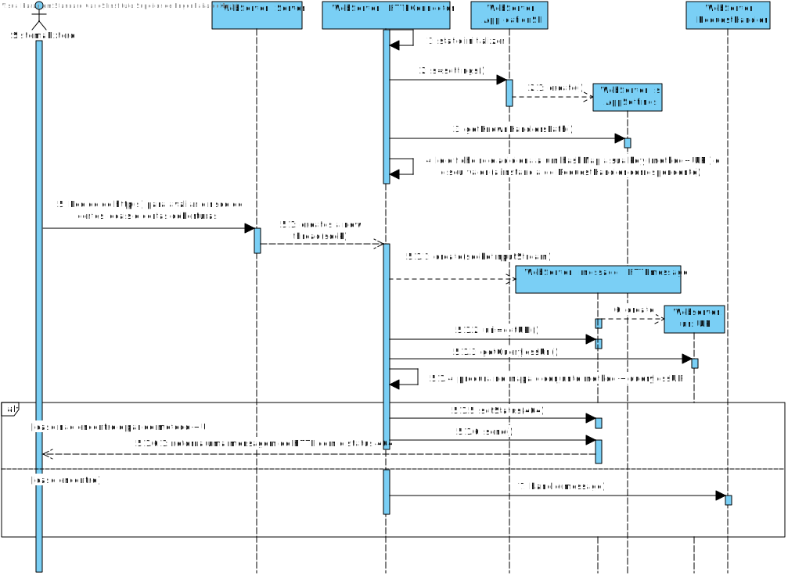
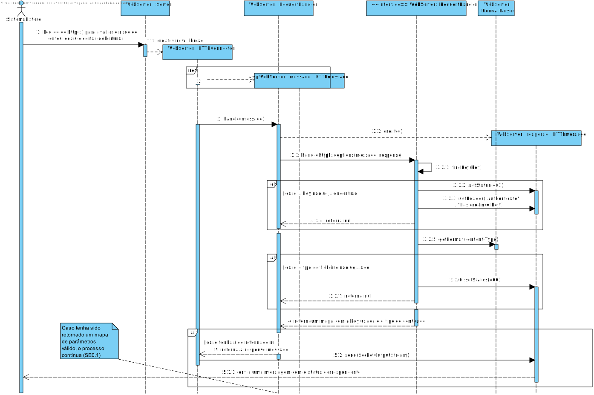

**Vasco Rodrigues [1171419](../)** - SE06.

=======================================

# 1. Requisitos

*Nesta secção o estudante deve indicar a funcionalidade desenvolvida bem como descrever a sua interpretação sobre a mesma e sua correlação e/ou dependência de/com outros requisitos.*

**SE06.** Como SE pretendo conhecer a disponibilidade atual (sim/não e carga atual) do Serviço de Avaliação de Risco para receber/processar novos pedidos.

* Critério de Aceitação: O processamento destas solicitações deve ocorrer com uma prioridade máxima relativamente ao processamento das restantes solicitações.

A interpretação feita deste requisito foi no sentido de implementar funcionalidade que permita saber se o Sistema consegue processar mais pedidos e quantos pedidos está a processar.

# 2. Análise

*Neste secção o estudante deve relatar o estudo/análise/comparação que fez com o intuito de tomar as melhores opções de design para a funcionalidade bem como aplicar diagramas/artefactos de análise adequados.*

*Recomenda-se que organize este conteúdo por subsecções.*

## 2.1. Análise do Requesito

* Conhecer a disponibilidade atual do Sistema é saber o número de threads ativas no momento da solicitação e se permite receber mais pedidos de avaliação.

* Este caso de uso terá de ser implementado no módulo RISK ASSESSMENT WEB SERVER pois trata-se de uma user story do Sistema Externo.

## 2.2. Regras de Negócio

* O solicitação é feita através de um request HTTP/HTTPS,que contém um identificador do sistema (token, previamente gerado), e é exportado o resultado em formato XML, JSON ou XHTML.

* O pedido só será aceite, caso o token recebido seja reconhecido pelo sistema e o Sistema possa receber o pedido, eteja disponível.

* O pedido só será aceite se a carga do Sistema suportar tal pedido(Aceite se menos de 30 pedidos no último minuto e 100 pedidos ao mesmo tempo)

## 2.3. Atores

* Sistema

* Sistema Externo

# 3. Design

*Nesta secção o estudante deve descrever o design adotado para satisfazer a funcionalidade. Entre outros, o estudante deve apresentar diagrama(s) de realização da funcionalidade, diagrama(s) de classes, identificação de padrões aplicados e quais foram os principais testes especificados para validar a funcionalidade.*

*Para além das secções sugeridas, podem ser incluídas outras.*

## 3.1. Realização da Funcionalidade

*Nesta secção deve apresentar e descrever o fluxo/sequência que permite realizar a funcionalidade.*

## 3.2. Diagrama de Classes

*Nesta secção deve apresentar e descrever as principais classes envolvidas na realização da funcionalidade.*

* **RISK ASSESSMENT WEB SERVER:**

	* Controlador: ServerAvailabilityController

	* Handler: ServerAvailabilityHandler

	* HTTPConnector,ThreadController,ThreadTimeController

## 3.3. Padrões/Principios Aplicados

*Nesta secção deve apresentar e explicar quais e como foram os padrões de design aplicados e as melhores práticas*

* GRASP

* SOLID

* Strategy(RequestHandlers e seus derivados)

* "Tell don't ask"

## 3.4. Testes

*Nesta secção deve sistematizar como os testes foram concebidos para permitir uma correta aferição da satisfação dos requisitos.*

**Teste 1:** Verificar que o Servidor pode estar disponível ou não

~~~~
    HTTPConnector h = new HTTPConnector(new Socket(), new ThreadController(1, 1), new ThreadTimeController(1));
	/**
     * Test of convertAvailibiltyBooleanToString method, of class ServerAvailabilityController.
     */
    @Test
    public void testConvertAvailibiltyBooleanToString() {
        System.out.println("convertAvailibiltyBooleanToString");
        ServerAvailabilityController instance = new ServerAvailabilityController();
        String expResult = "Available";
        String result = instance.convertAvailibiltyBooleanToString();
        assertEquals(expResult, result);
        h = new HTTPConnector(new Socket(), new ThreadController(10, 30), new ThreadTimeController(1));
        expResult = "Not Available";
        result = instance.convertAvailibiltyBooleanToString();
        assertEquals(expResult, result);
    }

    /**
     * Test of obtainServerCurrentAvailability method, of class ServerAvailabilityController.
     */
    @Test
    public void testObtainServerCurrentAvailability() {
        System.out.println("obtainServerCurrentAvailability");
        ServerAvailabilityController instance = new ServerAvailabilityController();
        boolean expResult = false;
        boolean result = instance.obtainServerCurrentAvailability();
        assertEquals(expResult, result);
        h = new HTTPConnector(new Socket(), new ThreadController(100, 29), new ThreadTimeController(1));
        expResult = true;
        result = instance.obtainServerCurrentAvailability();
        assertEquals(expResult, result);
        h = new HTTPConnector(new Socket(), new ThreadController(10, 30), new ThreadTimeController(1));
        expResult = true;
        result = instance.obtainServerCurrentAvailability();
        assertEquals(expResult, result);
    }
    ~~~~

**Teste 2:** Verificar que o Servidor tem carga variável e o valor atualizado é obtido(Melhor testado no ThreadControllerTest e ThreadTimeControllerTest)

~~~~
/**
     * Test of obtainServerCurrentLoad method, of class ServerAvailabilityController.
     */
    @Test
    public void testObtainServerCurrentLoad() {
        System.out.println("obtainServerCurrentLoad");
        ServerAvailabilityController instance = new ServerAvailabilityController();
        int expResult = 1;
        int result = instance.obtainServerCurrentLoad();
        assertEquals(expResult, result);
    }

    /**
     * Test of obtainServerCurrentLoadPerMinute method, of class ServerAvailabilityController.
     */
    @Test
    public void testObtainServerCurrentLoadPerMinute() {
        System.out.println("obtainServerCurrentLoadPerMinute");
        ServerAvailabilityController instance = new ServerAvailabilityController();
        int expResult = 1;
        int result = instance.obtainServerCurrentLoadPerMinute();
        assertEquals(expResult, result);
    }
    ~~~~

**Teste 3:** Verificar que a informação é exportada direita

~~~~
	/**
     * Test of exportIntoDesiredFileType method, of class ServerAvailabilityHandler.
     */
    @Test
    public void testExportIntoDesiredFileType() throws Exception {
        System.out.println("exportIntoDesiredFileType");
        String filetype = "XML";
        String content = "Server Available\n with load = 1\n and load per minute = 1";
        ServerAvailabilityHandler instance = new ServerAvailabilityHandler();
        instance.exportIntoDesiredFileType(filetype, content);
        assertEquals(Files.readAllLines(FileSystems.getDefault().getPath("", "SE06_Test.xml"), Charset.defaultCharset()), Files.readAllLines(FileSystems.getDefault().getPath("", "SE06.xml"), Charset.defaultCharset()));
        filetype = "XHTML";
        instance.exportIntoDesiredFileType(filetype, content);
        assertEquals(Files.readAllLines(FileSystems.getDefault().getPath("", "SE06_Test.xhtml"), Charset.defaultCharset()), Files.readAllLines(FileSystems.getDefault().getPath("", "SE06.xhtml"), Charset.defaultCharset()));
        filetype = "JSON";
        instance.exportIntoDesiredFileType(filetype, content);
        assertEquals(Files.readAllLines(FileSystems.getDefault().getPath("", "SE06_Test.json"), Charset.defaultCharset()), Files.readAllLines(FileSystems.getDefault().getPath("", "SE06.json"), Charset.defaultCharset()));
        File f = instance.exportIntoDesiredFileType("TXT", content);
        assertNull(f);
    }
~~~~

**Teste 3:** Verificar que método funciona e responde ao request da maneira pretendida
	~~~~/**
     * Test of handle method, of class MultipleRASubmissionRequestHandler.
     */
    @Test
    public void testHandle_PositiveResponse() {
        System.out.println("handle");
        HTTPmessage request = new HTTPmessage();
        request.setURI("/riskAssessment/currentload?export=xml");
        request.setRequestMethod("GET");
        request.setHeader("Authorization", "kuibjkhsabewfhjkuifu73g38wshgfilu");
        ServerAvailabilityHandler instance = new ServerAvailabilityHandler();
        HTTPmessage expResult = new HTTPmessage();
        expResult.setResponseStatus(Config.POSITIVE_RESPONSE);
        expResult.setContentFromFile("SE06_Test.xml");
        HTTPmessage result = instance.handle(request);
        assertEquals(expResult.getStatus(), result.getStatus());
    }~~~~

# 4. Implementação

*Nesta secção o estudante deve providenciar, se necessário, algumas evidências de que a implementação está em conformidade com o design efetuado. Para além disso, deve mencionar/descrever a existência de outros ficheiros (e.g. de configuração) relevantes e destacar commits relevantes;*

*Recomenda-se que organize este conteúdo por subsecções.*

## 4.1. Ficheiro de configuração do mapa de handlers

~~~~

<handler>

	<method>GET</method>

    <uri>/webServer/currentload</uri>

    <className>http.requestHandler.ServerAvailabilityHandler</className>

</handler>~~~~

## 4.2. Evidenciar utilização da funcionalidade GP01

~~~~
	protected int obtainServerCurrentLoad() {
        return HTTPConnector.obtainThreadController().getLoad();
    }
    
    protected int obtainServerCurrentLoadPerMinute() {
        return HTTPConnector.obtainThreadController().getLoadPerMinute();
    }
    
    protected boolean obtainServerCurrentAvailability() {
        return ((obtainServerCurrentLoad() >= settings.getMaxRequestForServer()) || (obtainServerCurrentLoadPerMinute() >= settings.getMaxRequestPerMinuteForServer()));
    } ~~~~

# 5. Integration/Demonstration

*Nesta secção o estudante deve descrever os esforços realizados no sentido de integrar a funcionalidade desenvolvida com as restantes funcionalidades do sistema.*

* Esta funcionalidade integra-se com a funcionalidade GP01, especificamente a GP01.2 visto que esta controla o número de pedidos que o servidor pode receber.

* Para esta UC foi necessário um estudo de como validar xmls, fazer transformaçoes etc.. e também a conexão com um servidor.

* Para integrar com as restantes funcionalidades do sistema foi necessário as devidas dependências e cuidado a seguir os padrões das restantes funcionalidades.

# 6. Observações

*Nesta secção sugere-se que o estudante apresente uma perspetiva critica sobre o trabalho desenvolvido apontando, por exemplo, outras alternativas e ou trabalhos futuros relacionados.*

* Utilização do padrão Strategy no RequestHandlers e seus derivados para cada funcionalidade do Sistema Externo.

* Esta funcionalidade depende de uma outra funcionalidade, a GP01, mais propriamente a GP01.2 que foi desenvolvida em paralelo.

* Em discussão com elementos de outro grupo, foi apresentada a ideia de ter uma classe com um mapa(SwitchMap) que para cada par (Method,URI) tinha uma classe correspondente que implementaria uma interface com um método de interpretação do pedido recebido. Apesar de na altura parecer uma ideia que acrescentaria classes desnecessárias ao projeto, a modularidade do projeto e legibilidade do código benificiam bastante desta implementação, pelo que a usaremos.

* Utilização de ferramentas adequadas para transformações, validações e passagens de tipos de ficheiro para outros tipos de ficheiro.

