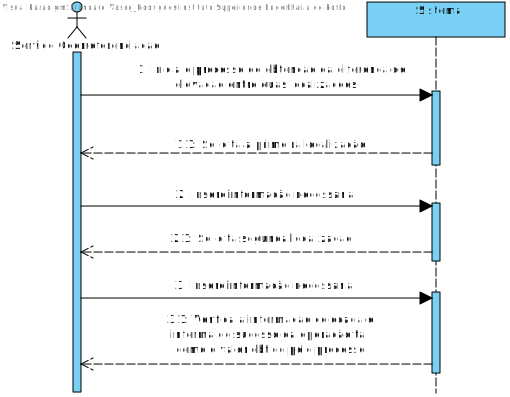
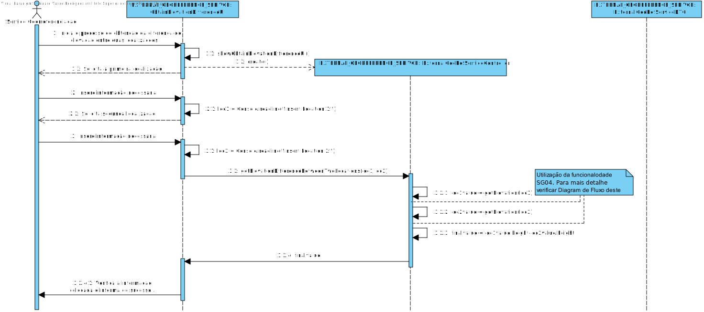
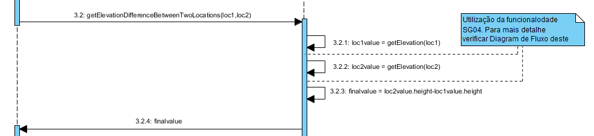
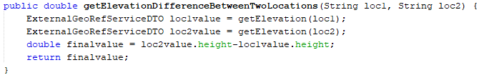

**Vasco Rodrigues [1171419](../)** - SG06.
=======================================

# 1. Requisitos

*Nesta secção o estudante deve indicar a funcionalidade desenvolvida bem como descrever a sua interpretação sobre a mesma e sua correlação e/ou dependência de/com outros requisitos.*

**SG06.** Como SG pretendo obter a diferença de elevação (em metros) relativamente ao nível médio da água do mar existente entre duas localizações.

* SG06.1. Esta informação deve ser obtida usando o serviço externo MBS.
* SG06.2. Esta informação deve ser obtida usando o serviço externo GMS.
* SG06.3. Esta informação deve ser obtida por combinação (i.e. valor médio) dos resultados dos serviços externos anteriores.
* SG06.4. O sistema deve usar o método anterior que estiver configurado para o efeito.

A interpretação feita deste requisito foi no sentido de implementar funcionalidade que permita saber a diferença de altitude entre 2 localizações inseridas pelo utilizador.

# 2. Análise

*Neste secção o estudante deve relatar o estudo/análise/comparação que fez com o intuito de tomar as melhores opções de design para a funcionalidade bem como aplicar diagramas/artefactos de análise adequados.*

*Recomenda-se que organize este conteúdo por subsecções.*

## 2.1. Análise do Requesito

* Obter a diferença de elevação entre duas localizações é a subtração da altitude da primeira localização com a segunda localização.

* Este caso de uso terá de ser implementado no módulo EXTERNAL GEORREFERENCE SERVICE pois trata-se de uma user story do Sistema Externo. No entanto, vai interagir com o módulo CORE pois requer regras de negócio que estão neste implementadas.

* A obtenção desta diferença será suportada pelo uso de duas APIs (MBS e GMS), onde o Serviço de GeoReferência dará a escolha as duas APIs ou uma junção de ambas, para a operação se realizar.

## 2.2. Regras de Negócio

## 2.3. Atores

* Sistema
* Sistema Georreferenciação

# 3. Design

*Nesta secção o estudante deve descrever o design adotado para satisfazer a funcionalidade. Entre outros, o estudante deve apresentar diagrama(s) de realização da funcionalidade, diagrama(s) de classes, identificação de padrões aplicados e quais foram os principais testes especificados para validar a funcionalidade.*

*Para além das secções sugeridas, podem ser incluídas outras.*

* Necessitamos de um http request realizado pelo Url para ser estabelecida a ligação com a API fornecida.
* Uma query com parametros para a API receber o endereço postal.
* Realizada uma coneção para "pedir" um ficheiro json com os dados para um certo endereço postal.

## 3.1. Realização da Funcionalidade

*Nesta secção deve apresentar e descrever o fluxo/sequência que permite realizar a funcionalidade.*

## 3.2. Diagrama de Classes

*Nesta secção deve apresentar e descrever as principais classes envolvidas na realização da funcionalidade.*

+ **EXTERNAL GEOREFERENCE SERVICE:**
	* Controlador: ExternalGeoRefServiceController
	* ApplicationGEO,AppSettingsGEO,GeoRefServiceDTO

## 3.3. Padrões/Principios Aplicados

*Nesta secção deve apresentar e explicar quais e como foram os padrões de design aplicados e as melhores práticas*

* GRASP
* SOLID
* "Tell don't ask"
* Strategy (aplicado no tratamento do url para o GMS e MBS);
* Builder(aplicado para contruir o JsonObject ,e para a Location);

## 3.4. Testes
*Nesta secção deve sistematizar como os testes foram concebidos para permitir uma correta aferição da satisfação dos requisitos.*

**Teste 1:** Testar a obtenção da diferença de elevação dependendo da configuração

	/**
     * Test of getElevationDifferenceBetweenTwoLocations method, of class ExternalGeoRefServiceController.
     */
    @Test
    public void testGetElevationDifferenceBetweenTwoLocations() throws Exception {
        System.out.println("getElevationDifferenceBetweenTwoLocations");
        String loc1 = "431,Rua Doutor Antonio Bernardino de Almeida";
        String loc2 = "115,Rua Sara Afonso";
        GeoreferenceServiceController instance = new GeoreferenceServiceController();
        double expResult = -1;
        if (selected.length == 2) {
            System.out.println("testGetElevationDifferenceBetweenTwoLocations - both");
            expResult = 27.199367523193388;
        } else {
            if (selected.length == 0) {
                fail("No configured Implementations");
            }
            System.out.println("testGetElevation -" + selected[0]);
            if (selected[0].equals(google)) {
                expResult = 30.39873504638676;//Dá negativo, verificar porque
            } else if (selected[0].equals(microsoft)) {
                expResult = 55;
            }
        }
        double result = instance.getElevationDifferenceBetweenTwoLocations(loc1,loc2);
        assertEquals(expResult, result, 0.0015);
    }

# 4. Implementação

*Nesta secção o estudante deve providenciar, se necessário, algumas evidências de que a implementação está em conformidade com o design efetuado. Para além disso, deve mencionar/descrever a existência de outros ficheiros (e.g. de configuração) relevantes e destacar commits relevantes;*

*Recomenda-se que organize este conteúdo por subsecções.*

## 4.1. Evidenciar utilização da funcionalidade SG04

# 5. Integration/Demonstration

*Nesta secção o estudante deve descrever os esforços realizados no sentido de integrar a funcionalidade desenvolvida com as restantes funcionalidades do sistema.*

* Esta funcionalidade integra-se com SG04, visto que utiliza a funcionalidade SG04.
* Como referido posteriormente, esta funcionalidade poderia estar integrada num menu desta funcionalidade mas como requesito especificam demonstração por "testes automáticos de regressão especificados em JUnit", este menu não existe.
* Para esta UC tive de perceber como funcionavam as apis, parametros que recebia e o seu retorno, bem como a conexão as mesmas.
* Para a realização desta UC foi ainda necessário entender como tratar ficheiros json, e como tratá-los da melhor maneira.

# 6. Observações

*Nesta secção sugere-se que o estudante apresente uma perspetiva critica sobre o trabalho desenvolvido apontando, por exemplo, outras alternativas e ou trabalhos futuros relacionados.*

* Design reflete apenas o que pertence a esta funcionalidade sendo que utiliza outra funcionalidade deste módulo, a parte do meu diagrama de fluxo onde utilizo essa parte irá ter uma nota referindo para verificar diagrama de sequencia da outra funcionalidade referida(obter elevação de uma localização: SG04)
* Como este módulo pode ser demonstrado por testes, não foi criado UI, mas um trabalho futuro seria a criação de uma UI e integração da mesma num menu deste módulo.

